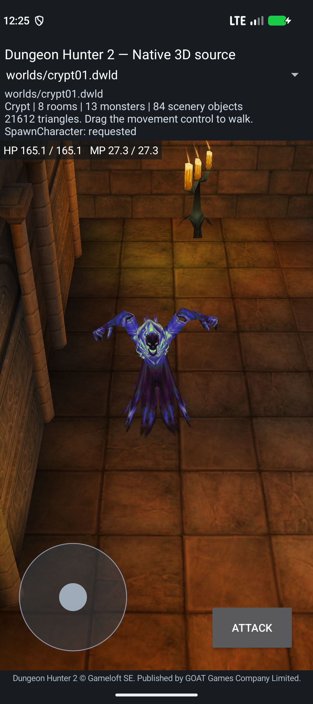
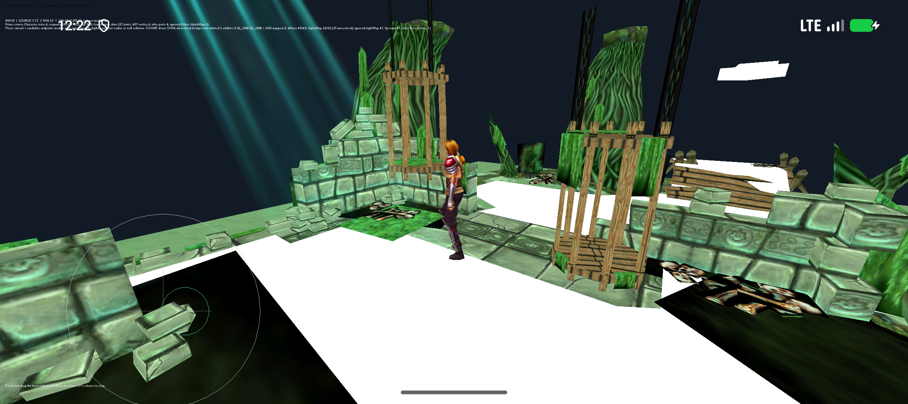

# Shared Character runtime and Crypt Spawn checkpoint

2026-10-04. Branch: `reconstruction/android17-irrlicht-rebuild-2026-10-03`.
The [combined status](COMBINED-RECONSTRUCTION-STATUS.md) contains the project
brief, Adam comparison, complete subsystem overview and completion gates.
This document records the next source milestone after commit `27a6801`.
It retains the `f811f80` artifact identities. The subsequent
[Crypt script checkpoint](CRYPT-SCRIPT-CHECKPOINT-2026-10-04.md) connects the
original GhostAmbush01 contact/Wait/Spawn path and corrects earlier hallway
shorthand; those changes are not retroactively claimed for these APKs.

## Source advancement

| Component | Implemented source | What it now does | Remaining boundary |
|---|---|---|---|
| Shared Character owner | [`character_coordinator`](../port/level-world/character_coordinator.hpp) | Owns logical state and stable timers; supports synchronous reentry, fact refresh, captured timer events and exception cleanup. Crypt Prince and Irrlicht Prince both consume it. | Physics, playback, AI, scripts and rendering remain explicit backend services. This is not an original ARM32 layout overlay. |
| Limbus and Spawn | [`character_state`](../port/level-world/character_state.cpp), [`character-spawn notes`](../port/level-world/reference/character-spawn/NOTES.md) | Source state 0/1 service ordering, flags, animation selection, completion and optional named-event body initialization. | Complete respawn/group producers, PreSpawn and revival remain incomplete. |
| Script spawn request | [`character_factory`](../port/level-world/character_factory.cpp) | Case-sensitive exact-name request on an already-loaded actor, atomic miss/duplicate rejection and Spawn registration check. | Does not allocate a Character or supply the authored hallway trigger. |
| Crypt descriptor | [`objects`](../port/level-world/objects.cpp), [`prepare_actors`](../port/level-world/tools/prepare_actors.py) | DACT v2 adds a validated gated-spawn bit, retains v1 support and includes two directly resolved surprise ghosts. | Four template ambushers and other conditional/factory records remain unresolved in this bundle. |
| Crypt native adapter | [`model_renderer`](../port/android-native/app/src/main/cpp/model_renderer.cpp) | Each Ghost owns a coordinator and stable native body services; actual Spawn completion constructs its body, then selects Idle. World replacement/Activity recreation retain logical state and recreate bodies. | Initial hiding and debug spawn injection are development policies. Gated actors' combat/AI services are incomplete and combat commands are explicitly rejected. |
| Weighted template resolution | [`character_template_factory`](../port/level-world/character_template_factory.cpp), [source notes](../port/level-world/reference/character-template-factory/NOTES.md) | Host-tested exact runtime key, five duplicate-preserving slots, selected property row and ClassID/name projection for all four ambusher records. | Caller must supply the original random-selected index. Not wired into the native actor factory; no property-default/class-formula evaluation is claimed. |
| Irrlicht Prince | [`prince_character_runtime`](../port/irrlicht-android/game/prince_character_runtime.cpp), [`prince_actor`](../port/irrlicht-android/game/prince_actor.cpp) | Loads the complete authored bank, uses the shared state coordinator and two-slot blended playback, and supplies owner/helper/authored transforms to four mutable skins. | SWAMP input/position/camera remain development producers. Physics, AI and combat are not connected to this route. |

The Crypt bundle now has **97 of 166 object records: 84 scenery and 13 monsters**.
Two of those monsters are bounded source Spawn actors; the 11 earlier NPCs retain
their previous development gameplay adapter. **69 records remain pending**.
The full-bank Irrlicht route registers **116 resources / 158 occurrences**;
only the bounded Idle/Move paths are exercised live. One registered resource
has no serialized animation accessor/timeline; no duration is invented for it.

## Findings corrected by original instructions and real assets

- `Script_SpawnCharacter::Execute` (`0x45f400`) looks up an existing named
  Character. Treating it as an allocator would reconstruct the wrong contract.
- `CSSpawn::OnFocus` (`0x3c35ec`) selects the exact Spawn member at animation
  table offset `0x80`; this path does not add a stance to its sequence.
- **Corrected in the next source checkpoint:** this f811 snapshot mislabeled
  Character vptr `+0x40` as `GameObject::IsUpdatable` (`0x38aac0`). It is
  `GameObject::SetVisible` (`0x38b0f0`), because the vptr uses a `+8` address point.
  The following describes the old adapter behavior:
  a constant-true query. It does not change visibility.
- `VisualObject::StartFadeIn` (`0x470ce4`) and `UpdateFadeIn` (`0x470cec`) are
  return stubs. The Ghost's raw property argument is 3000; a timed alpha fade
  or seconds conversion is not supported by this original binary.
- Real Ghost Spawn clip **714** has no `is_interactive` event. It emits finite
  completion `0x22`; Spawn blur creates the fallback body before Idle. The
  separate named-event branch is covered by a host fixture only.
- Renderer state cannot be considered ready when SWAMP geometry assembly is
  logged: loading the entire bank follows that step. The device harness now
  waits for the first successful GLES swap after source Character initialization.
  The earlier black screenshot was taken before readiness; later same-process
  frames were visible. No GPU failure is inferred from that early capture.
- The old NPC death scheduler cannot safely control a Ghost already owned by
  the new coordinator. The development target selector excludes these actors
  until their combat/death services are reconstructed and bound.

## Function mapping and source quantities

The [mapping extension](generated/character-runtime-function-map.json) verifies
**41 original function ranges, symbols and full byte hashes** against the
original symbol index and assembly: 30 Spawn/service ranges and 11 template
selection/dependency ranges. It adds **25 addresses** to the pinned
Adam ledger of 1,455, giving **1,480 unique mapped original addresses**.
Each row identifies implemented kernels, bounded services or caller evidence;
this is not a claim of 1,480 fully rebuilt functions. Constructor, registration,
PreSpawn and broad AI/revival contracts remain explicitly marked as evidence.

The current source inventory records **396 maintained reconstruction/port
files / 45,555 lines**, compared with 388 / 43,881 at the preceding checkpoint.
It excludes upstream/vendor code, recovered corpora, fixtures, tests/tools and
the separately counted 288 repaired/decompiled Java files. File and line
quantities do not measure gameplay fidelity. See the
[inventory](../reports/combined-source-inventory.json).

```powershell
python tools/verify_combined_function_audit.py --git-index
python tools/character_runtime_function_map.py --check
python tools/source_inventory.py
```

## Exact development builds and tests

| Build | Bytes | SHA-256 | Tested scope |
|---|---:|---|---|
| `port/android-native/app/build/character-spawn-checkpoint.apk` | 24,274,722 | `2b7b064c2d55d92b893c855c6297215263724f8056ae430141576a9a33c46a37` | Both Ghosts: exact-name miss, Spawn → Idle, real body creation, independent state, native world replacement, rotation and unsupported-combat rejection. |
| `port/android-app/build/irrlicht-swamp-prince-character-candidate/dh2-swamp-irrlicht-source-local-debug.apk` | 71,416,410 | `b367d0fa2e21ebae18c2552e81c16a398f0d4adb3d60b9c07eaf18f9f74dd8f1` | Complete bank registration, visible source-skinned Prince, two-axis touch Move/Idle and same-process background/resume. |

Both package ARM64 and x86_64 native source libraries with 16 KiB ELF alignment
and target API 37. Device tests used **Android 17/API 37, x86_64,
`PAGE_SIZE=16384`**, `emulator-5558`. The Irrlicht package also passes signing
and ZIP alignment checks. Physical ARM64 gameplay remains untested.

The Crypt Prince combat/bank regression passed on the preceding artifact
`d3bc3154823fd24ab7a9eb1a356f12c1db9dff90cfc84473d697556449fc7257`.
Its report is retained with that identity; it is not relabeled as a complete
combat regression of the final `2b7` APK. The final artifact adds native reload
teardown and rejects unsupported Ghost combat, then passes its own focused
spawn/reload/rotation test. Earlier checkpoint evidence remains historical.

| Evidence | Result |
|---|---|
| [Shared host kernels](../reports/reconstruction-2026-10-04/character-runtime/host-kernels.json) | Coordinator reentry/timers/exception cleanup; 10 Spawn cases, 5 factory guards, 14 ordered requests; baseline 95 descriptor records preserved, two Ghosts added, four malformed descriptors rejected. |
| [Template factory host report](../reports/reconstruction-2026-10-04/character-runtime/template-factory-host.json) | PASS actual cache/MGP fixture plus selected template/property/class projections and input guards; no actor creation or random selection claim. |
| [Crypt Spawn device report](../reports/reconstruction-2026-10-04/character-runtime/crypt-spawn-runtime.json) | PASS for final `2b7` APK; trigger and autonomous AI explicitly not verified. |
| [Crypt Prince regression](../reports/reconstruction-2026-10-04/character-runtime/crypt-prince-regression.json) | PASS for prior `d3bc` APK, with its own identity and scope. |
| [Irrlicht host report](../reports/reconstruction-2026-10-04/character-runtime/irrlicht-character-host.json) | PASS full-bank composition and CPU skins; Walk pose differs, one owner translation has approximately 0.00000338 RMS error. |
| [Irrlicht build report](../reports/reconstruction-2026-10-04/character-runtime/irrlicht-character-build.json) | PASS source build/package evidence for `b367`; the build's release-eligible field remains false because this is an incomplete development diagnostic. |
| [Irrlicht device report](../reports/reconstruction-2026-10-04/character-runtime/irrlicht-character-runtime.json) | State 3 / sequence 262 / clips 1040–1041 → state 4 / sequence 280 / clip 1126 → released state 3. Position retained after resume; no fatal markers. |

Manual inspection confirms the full Ghost and Prince are visible in the
sampled states. SWAMP still has white fallback floor bands and dark material
patches. These tests do not prove campaign playability, every animation pose,
autonomous AI, process-death saves or physical-phone compatibility.





## Reproduce the focused device checks

Use an explicit API 37/16 KiB emulator and an ADB path from the installed SDK.
The Crypt harness leaves installation to the caller. Debug commands require
the development build and Android DUMP permission.

```powershell
adb -s emulator-5558 install -r port/android-native/app/build/character-spawn-checkpoint.apk
python port/android-native/tools/character_spawn_smoke.py --adb <sdk>/platform-tools/adb.exe --serial emulator-5558 --apk port/android-native/app/build/character-spawn-checkpoint.apk --output <local-test-output>
python port/android-app/tests/irrlicht_swamp_native_runtime.py --adb <sdk>/platform-tools/adb.exe --serial emulator-5558 --apk port/android-app/build/irrlicht-swamp-prince-character-candidate/dh2-swamp-irrlicht-source-local-debug.apk --output <local-test-output> --require-prince-character
```

## Next source work

1. Connect the now host-tested template/property/class resolver to native
   actor construction using original random selection and property defaults.
   `MonsterCommonType1` is an editor template label; runtime
   keys select `GothicusCrypt_Ghosts`. Its five slots are four `Crypt_Ghost`
   entries and one `Crypt_Ghost_RE`. Exact variant selection needs the source
   random-state/draw-order inputs; no variant is silently assigned.
2. Connect the shared actor/physics/frame ownership to Irrlicht and reconstruct
   full enemy AI/combat/death services, preserving original update ordering.
3. Recover level-owned triggers/Lua dispatch, quests/rewards and transitions
   so an original level can be completed.
4. Complete content/material/UI/audio coverage, campaign saves and validated
   fan script/data changes, then prove physical ARM64 gameplay.

The complete reconstruction goal remains active. Private documents and their
contents remain outside Git; this milestone uses the separate branch and no
external archive upload.
