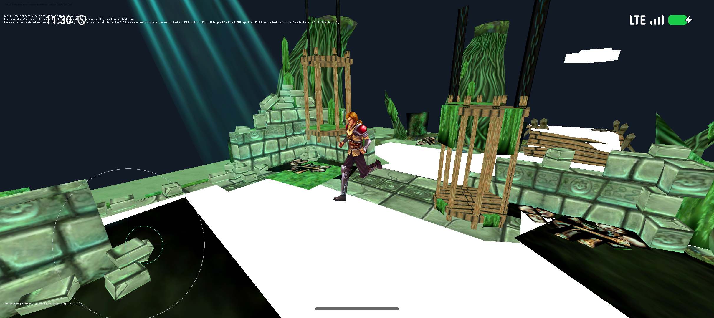

# Combined reconstruction status and continuation brief

Updated 2026-10-04. Working branch: `reconstruction/android17-irrlicht-rebuild-2026-10-03`.
Adam reference: [`AdamCelermajer/DH_sc`](https://github.com/AdamCelermajer/DH_sc), commit `45c5348e807607a2825211bb8f26248067ba9106`.

This report supersedes older documents' descriptions of the current default development build. Historical reports retain their original artifact identities and test scopes.

**Latest source milestone:** [Level initialization checkpoint](SOURCE-LEVEL-INITIALIZATION-CHECKPOINT-2026-10-04.md), APK `0bd8a06f...` (27,173,166 bytes). Both native ABIs compile 40 bounded AI/script/zone units and pass 60 export groups, ELF64/16 KiB and signing checks. The exact APK passes API37/16 KiB ambush/spawn/reload/recreation tests with 418 frozen actual compiler/build inputs and 246 assets. The full 33/51-row level catalogue, Crypt constructor field slice and three source range callbacks are live in the viewport. Original monster OnInit with real class/HP/MP/debug/file persistence passes 18 positive host catalogue cases; managed native PlayerInfo and live AIS activation remain pending. Same pending-to-active VM ownership, debug persistence and Module bounds now have isolated proofs.

## Improved project brief

Reconstruct Dungeon Hunter 2's game logic and engine behavior as maintainable, buildable source by combining Adam Celermajer's research with the existing recovery and implementation work. Produce a native 64-bit Android app for the current Android release, with 16 KiB memory-page compatibility, that preserves the original gameplay and content and supports documented fan changes to data, assets and scripts.

Maintain an evidence-backed ledger from original symbols, addresses, data layouts and scripts to reconstructed implementations. Distinguish recovered evidence, compilable implementation, isolated behavior tests and live gameplay integration. Exercise actual movement, combat, levels, progression, saves and Android lifecycle behavior; investigate and fix failures. Use upstream Irrlicht to help reconstruct the game's customized `glitch::` engine, preserving known custom behavior rather than assuming upstream is interchangeable.

Keep private documents and their contents outside Git. Publish coherent source milestones on the reconstruction branch. Do not update PR #1 or upload to Drive. Runtime validation for this project uses the modern Android 17/API 37 16 KiB development emulator; no Fold7 or 4 KiB test is requested.

### Completion gates

1. A clean checkout builds the app and its game/engine code for ARM64 without the original ARM32 game binary or a translation runtime.
2. Original content is loadable through a documented asset installation/export pipeline. Authored and generated levels, transitions and object factories work.
3. Player classes, equipment, skills, enemies, AI, quests, loot, progression and game UI work together through the reconstructed runtime.
4. Persistent saves survive process death and app updates; audio, effects, input and lifecycle behavior work.
5. Android compatibility is demonstrated by source builds, native-library/ZIP alignment checks and gameplay tests; physical ARM64 execution remains a separate required proof.
6. Original-to-source mappings and reproducible tests accompany reconstructed behavior; uncertainty and approximations are visible.
7. Fan changes have documented entry points, validation and a way to restore the baseline.

Exact lost studio source text is not required to meet these gates. Reconstructed code must reproduce its behavior. The goal is active; these gates have not all been met.

## Where the project actually stands

There is now a source-built native **Crypt development app** under [`port/android-native`](../port/android-native/README.md). It renders the Prince and an original authored eight-room Crypt layout, with 13 resolved monster records and 84 scenery objects. The two surprise Ghosts now appear through the original GhostAmbush01 trigger and timed script, reconstructed Limbus/Spawn/Idle states and real native body creation; their full combat/AI services remain pending. It uses reconstructed world, scene, animation, skinning, character, navigation, physics and combat code. The renderer is a development GLES2 implementation. Its camera, touch control and some gameplay service boundaries are development adapters.

There is also our separate source app under [`port/android-app`](../port/android-app/README.md), containing an authored encounter, Lua/stat/equipment/quest diagnostic integration, Infected Village and SWAMP previews, and an Irrlicht NativeActivity route. The Irrlicht SWAMP route now uses the Prince's four source warrior skins, mapped atlas, complete authored bank registration and two-slot playback through the shared Character coordinator. It reuses Adam's skinning and visual owner/helper/graph code. A level session owns a real player body, navigation registry and path storage. Source Move focus/blur dispatches unpin and Stop then Pin; root motion, one physics step and actor update feed the rendered pose. The exact current APK passes free movement, original navigation boundary sliding and same-process resume on API 37/16 KiB. Environment bodies, other module seams, enemy AI/combat and complete game flow remain pending. Two source additive bridge-overlay states are mapped. Source navigation floors, room bounds and exit markers are now excluded from scenery while their navigation data remains available; the white floor bands are resolved. A newer source-alpha preview removes the dark foliage/ground rectangles by copying the original shader's blue mask into diffuse alpha and enabling fractional-alpha blending on the 22 resolved Material__11611 draws. The newer selector-driven build decodes AL in both source profiles. Original runtime profile/effect group, compiled shader ordinal, blend/depth state and remaining rendering gaps are still being reconstructed.

These are **two development runtimes**, not a completed game. The source is substantial and real, but integration, full game flow and content coverage remain incomplete. The old ARM32 compatibility wrapper is retained as historical/reference work; it does not satisfy the native-rebuild completion gate.

## How much source has been rebuilt?

A single honest game-wide percentage is not available. There is no audited list assigning every original function to one implementation and proving it is linked, exercised and behaviorally equivalent in the finished game. Dependencies, duplicate symbols, generated exports and test scaffolding must not count as rebuilt game logic.

Use the following concrete measures instead:

| Measure | Established amount | Meaning and limit |
|---|---:|---|
| Original engine function ranges | 31,018 | Original symbol/assembly inventory; includes engine, libraries and support code. Not a count of reconstructed functions. |
| Adam original-address mapping reach | 1,455 unique addresses / 137 manifests | 2,210 repeated checkpoint records deduplicated by address. Mapping/evidence reach, not a completed implementation count. |
| Current Character/engine mapping extension | 425 verified unique ranges / 638 evidence records across 57 manifests; 293 additional addresses; 1,748 combined unique addresses | Limbus/Spawn/factory, template/RNG, Crypt trigger/script, respawn/group/aggro, acquisition/event/target/master/range/pause/external-Lua/state-callback kernels, visibility and material-selector evidence. Duplicate evidence is deduplicated; implementation boundaries are explicit. Not a count of fully rebuilt functions. |
| Earlier selective-import mapping reach | 133 unique addresses / 9 manifests | Much of Adam's deeper mapping was initially omitted; evidence restoration is part of this continuation. |
| Original engine pseudocode exports | 31,794 successful exports | Generated decompiler text; not correct compilable C++ and not the same denominator as unique symbol ranges. |
| Engine `.text` bytes accounted for | 99.989968% | Assembly/disassembly accounting only. No source/game-completion percentage follows from it. |
| Original plaintext scripts recovered | 219 files / 900,493 bytes | Actual cache Lua source, preserved exactly. Native service ownership and complete live execution remain incomplete. |
| Repaired/decompiled Android Java | 288 source files | Source recovery/reconstruction of Android glue; distinguish it from independently reconstructed native gameplay. |
| Maintained reconstruction/port code | 511 source files / 59,685 lines / 3,120,554 bytes; 685 test/tool files | Git-index inventory excludes dependencies, recovered evidence, packaged scripts/assets and unfinished drafts. Includes imported code with local changes. Source size is not game completion. |
| Adam core modules imported | 577 files / 2,929,226 bytes | Seven modules imported at a pinned commit before dependency-path adaptations; includes headers/tools/tests, not 577 gameplay implementations. |
| Adam script runtime imported | 158 files / 1,064,065 bytes | Isolated import includes Lua dependency source; do not count all of it as reconstructed game code. |
| Current native app bundled assets | 243 | A selected Crypt/Prince development bundle including paired trigger scripts, two unchanged monster AI scripts and bounded provenance; not the complete game cache. |
| Crypt object instantiation | 97 / 166 records | 84 decor plus 13 monster records, including two gated first-spawn actors; 69 conditional/script/template/factory records remain. This fraction applies only to this authored level's object records. |
| Prince animation bank | 116 resources / 158 occurrences | Live two-slot registration/playback in Adam's runtime; full original pose/GPU parity is not established. |
| New Irrlicht Prince slice | 4 controllers / 27 joint references / 487 vertices / 586 triangles; module0 has 2 floors / 99 triangles / 133 graph nodes | Four default warrior parts and complete bank/shared state feed source root motion and an owned player body. Only Idle/Move exercised live; environment bodies, other modules, original camera, AI/combat and effects remain incomplete. |

The reproducible [`combined-source-inventory.json`](../reports/combined-source-inventory.json) and [`tools/source_inventory.py`](../tools/source_inventory.py) count the maintained source tree separately from vendor code, archived pseudocode and tests. The inventory also separates repaired/decompiled Java. File/line quantities measure repository size; they are not a claim of game fidelity or completion. The [function audit](generated/combined-function-audit.md) and [1,455-address ledger](generated/combined-function-audit.json) preserve per-address symbols, ranges, map files and provenance. The [277-file evidence import ledger](generated/adam-evidence-import.json) records restored hashes and remaining unavailable references.

## What Adam contributed and what our work adds

| System | Our existing work | Adam's contribution now imported | Combined result / gap |
|---|---|---|---|
| Evidence and cache | Exact assembly, symbols, pseudocode, Java/smali, shaders/configuration; complete-cache verification | Further subsystem disassembly, original-instruction comparisons and runtime checkpoints | Broad evidence with two independent research trails; references/report corpora require reconciliation. |
| Engine resources | BRES fixups, math and payload views; full-cache differential checks | Shared identical math/resource foundation; deeper scene/animation resource consumers | Buildable source readers; source contracts differ in some payload APIs and must stay explicit. |
| Materials/textures | Texture/material parsers and Android/Irrlicht previews | Scene-material resolution, GLES rendering and actor resources | Complementary rendering paths; full original GPU pass/effect fidelity remains open. |
| Animation/skinning | Typed values, pose/timeline/mixing/layers/transitions/root delta; mutable Irrlicht meshes and shared Character coordinator | Live Prince bank, compiled transforms, two-slot playback, event routing, skin deformation and visual owner/helper composition | Complete authored bank registration/blended playback now feeds both renderers; bounded Irrlicht Idle/Move and Crypt gameplay pass. Complete AI/Lua ownership and full pose parity remain pending. |
| World/navigation | SWAMP and Infected Village data, movement/floor components; source-to-actor floor bridge and level session | Authored Crypt, native floor graph, path search, smoothing, avoidance, producers | SWAMP module-zero geometry/flags feed Adam's collision/graph view live; Android verifies free motion and validated boundary sliding. Generated rooms, remaining modules, complete environment collision and enemy pursuit remain incomplete. |
| Physics/actor | Actor registry, shared state/timer ownership, exact-name spawn factory, Limbus/Spawn/respawn/group kernels and owned SWAMP session | Box2D source, native body/filter/transform services and Prince actor/frame coordinator | Source Character services own Irrlicht Stop/pin/unpin; each logical tick has one world step. Two Ghosts create real bodies on source Spawn completion. Full template/factory/lifecycle and enemy controllers remain open. |
| Stats/equipment | Character properties/classes, item/power calculations, Lua object bindings | Live actor properties, vitals, animation/combat tables | Tested calculations exist. Complete inventory/equip/power/buff ownership is not live in the combined Crypt app. |
| Combat/AI | Damage/health/death and counted-kill kernels, authored encounter | Animation-event combat, player/monster hit application, target/range/faction/aggro research | A real native combat slice exists. Full AI FSM, pursuit, skills/status effects, rewards and original service order remain unfinished. |
| Quests/scripts/triggers | Quest table/compile/progress, original Lua, owned Crypt script session and source trigger producer | Lua aliases/timers/callback research and native Character event consumers | Original GhostAmbush01 contact/Wait/Spawn now runs natively with source frame ordering. Other script services and campaign progression remain incomplete. |
| Saves | Authored encounter persistence and original save inspection | In-process combat restoration during Activity/GL recreation | Neither proves complete original-compatible campaign saves across process death. |
| Android | API 37 ARM64/x86_64 source app and Irrlicht integration | API 37 native Crypt Gradle app with aligned libraries | Both build; physical ARM64 gameplay and complete release validation remain open. |
| Fan modding | Editable scripts/data and recovery tools | Structured asset/data readers and native runtime | Initial validated asset override loader added to the Crypt app; full script/mod APIs and packaging remain future work. |

## Actual reverse-engineering mapping

The following are implementation anchors, not claims that entire original classes have been recovered. Original symbols/addresses in `original-functions.json`, assembly exports and per-module notes supply evidence.

| Original behavior / evidence | Source implementation | Current integration |
|---|---|---|
| `glitch::` Irrlicht lineage and custom scene/driver interfaces | [`irrlicht-feasibility`](../port/irrlicht-feasibility/README.md), [`scene_mesh_adapter`](../port/irrlicht-android/game/scene_mesh_adapter.hpp) | Source Irrlicht diagnostic. Original custom driver is not a drop-in upstream replacement. |
| BRES resource headers, relocations and pointer tables | [`engine-resources`](../port/engine-resources/README.md) | Shared reader foundation; complete-cache instruction comparisons reported. |
| Mesh payloads, scene graph, materials and controllers | [`asset-payloads`](../port/asset-payloads/README.md), [`scene-materials`](../port/scene-materials/README.md), [`engine-skinning`](../port/engine-skinning/README.md) | Crypt scene and skinned Prince; separate older preview readers remain. |
| Animation transform/time evaluation, clip registration and occurrence playback | [`engine-animation`](../port/engine-animation/README.md), [`actor_blended_playback.hpp`](../port/level-world/actor_blended_playback.hpp) | Live Prince bank. Exact ordered registration and selected comparisons are distinct from whole-bank pose equivalence. |
| `PFFloor::_LoadNavMesh` at `0x520b40`; `Module::LoadModule` at `0x38a88c` | [`level-world`](../port/level-world/README.md), [`original-functions.json`](../port/level-world/original-functions.json) | Authored Crypt floor/room extraction and native navigation. |
| `PFFloor::GetCollisionAt` at `0x51b96c`; `PFWorld::GetFloorHeightAt` at `0x525508` | [`floors.hpp`](../port/level-world/floors.hpp), navigation/floor source under `level-world` | Actual floor service and separately identified startup probes; probes are not moving AI proof. |
| `Structs::CharacterProperties::read` at `0x4f2750`; `Arrays::CharacterTable::read` at `0x4b4340` | [`game-data`](../port/game-data/README.md), [`character-properties`](../port/character-properties/README.md) | Recovered portable table/state projections; original pointers/ABI are not overlaid on ARM64. |
| Character state, timer, stance, path commands and frame order | [`character_state.hpp`](../port/level-world/character_state.hpp), [`actor_runtime.hpp`](../port/level-world/actor_runtime.hpp) | Live Prince; explicit service requests identify unfinished camera/AI/effects ownership. |
| `Script_SpawnCharacter::Execute` at `0x45f400`; `CSSpawn::OnFocus` at `0x3c35ec`; Limbus/Spawn transitions and service dependencies | [`character_factory.cpp`](../port/level-world/character_factory.cpp), [`character_coordinator.hpp`](../port/level-world/character_coordinator.hpp), [82-range mapping extension](generated/character-runtime-function-map.json) | Two direct Crypt Ghosts run original GhostAmbush01  then  source Spawn  then  Idle with real bodies; separate Hallway templates, full AI/combat and respawn/group ownership remain pending. |
| `Character::SafeGetCharPropsTemplateId` at `0x3b36ec`; `SafeGetCharPropsId` at `0x3b3d38` | [`character_template_factory.cpp`](../port/level-world/character_template_factory.cpp), [`character_template_random.cpp`](../port/level-world/character_template_random.cpp) | Host-tested five-slot template/property/class projection and ordinary-stream draw for four ambushers. Startup seed/draw order, property defaults and native actor integration remain pending. |
| `ScriptManager::ExecuteScript` at `0x45c16c`; `Level::Update` at `0x3f82d8`; original Wait/Spawn command bytes | [`crypt_spawn_script_session.cpp`](../port/level-world/crypt_spawn_script_session.cpp), [`script_runtime.cpp`](../port/script-runtime/script_runtime.cpp) | Live owned GhostAmbush01 session; blocking check precedes Wait update, ScriptManager precedes physics/ObjectManager. Other command services and full class bodies remain pending. |
| Visual root-motion history, displacement cancellation and owner/helper/authored transforms | [`visual_motion.hpp`](../port/level-world/visual_motion.hpp), [`visual_motion.cpp`](../port/level-world/visual_motion.cpp) | Live Crypt source behavior; required by the Irrlicht actor integration so clip-local placement does not displace the rendered character incorrectly. |
| Melee result, hit/health/death application and authored animation events | [`game-data`](../port/game-data/README.md), [`character-damage`](../port/character-damage/README.md), [`character-death`](../port/character-death/README.md) | Crypt player/monster applications plus separate Lua diagnostics. Status/audio/loot/quest consumers are incomplete. |
| Quest array reader at `0x4b8acc`; quest record reader at `0x504a94` | [`quest-data`](../port/quest-data/README.md), [`quest-compile`](../port/quest-compile/README.md), [`quest-kill`](../port/quest-kill/README.md) | 64 real quests and supported counted-kill diagnostic integration. Full quest lifecycle/rewards/campaign flow remain open. |
| `GameObject::IsTouching`, trigger gates and `Zone::InitPost`/absolute bounds | [`crypt_spawn_trigger.hpp`](../port/level-world/crypt_spawn_trigger.hpp), [`trigger-contact`](../port/trigger-contact/README.md), [`zone-contact-runtime`](../port/zone-contact-runtime/README.md) | Original Crypt trigger now uses source absolute-AABB overlap in the app. Separate Zone::IsInside has its own physical-object/selector guards; it is not the trigger call chain. |
| `GroupInfo::CanRespawn` at `0x3d2a34`; `SM_IsInLimbus` at `0x3c01c0`; `AI_ClearAllAggro` at `0x3d5fa8` | [`character_group_respawn`](../port/level-world/character_group_respawn.hpp), [`character_aggro_cleanup`](../port/level-world/character_aggro_cleanup.hpp) | Host-tested all-member predicate and retained-peer cleanup/OnDeAggro ordering. Native group/map storage and real AI/Lua callbacks remain unbound. |
| `CSLimbus::OnFocus` at `0x3c2e58`; Character respawn decisions; post-Revive group branch of `CSLimbus::OnBlur` | [`character_limbus_respawn`](../port/level-world/character_limbus_respawn.hpp), [`character_respawn_outer`](../port/level-world/character_respawn_outer.hpp), [`character_group_limbus_blur`](../port/level-world/character_group_limbus_blur.hpp) | Fresh two-read timer producer, signed property delay arithmetic and any-other-Limbus group producer pass host checks. Group blur also passes seven original ARM branch cases. Native property/group/hosting/event ownership remains unbound. |
| `GameObject::SetVisible` at `0x38b0f0`, actual Character vtable address point and constructor bytes | [visibility audit](../port/level-world/reference/character-spawn-visibility/NOTES.md), [`character_state`](../port/level-world/character_state.hpp) | Corrected native Limbus/Spawn visibility service; hidden actors still update their timers. General condition/network-enabled producers and complete visual synchronization remain open. |
| Source Move body services, native world step, navigation and visual actor phase ordering | [`swamp_actor_session`](../port/irrlicht-android/game/swamp_actor_session.hpp), [`swamp_actor_floor_bridge`](../port/irrlicht-android/game/swamp_actor_floor_bridge.hpp) | Owned module0 player session passes Android movement/slide/resume; body is detached before world teardown. Development20ms clock/input and absent environment bodies are explicit boundaries. |
| Authored MGP/MLX Character identities and scripted spawn requests | [`actor-runtime`](../port/actor-runtime/README.md), [`level-runtime`](../port/level-runtime/README.md) | Registry/source trace. A registered or requested actor is not automatically a live rendered Character. |

## Findings that materially changed the approach

- The engine lineage is Irrlicht, with substantial custom `glitch::` interfaces and rendering changes. Upstream source is useful for reconstruction; replacing names alone cannot restore that fork.
- The complete local cache has 6,833 CRC-valid files, 2,904 BRES resources and the Prince model. An older partial-cache manifest is retained as historical evidence and must not be treated as the complete input. See [`COMPLETE-CACHE.md`](COMPLETE-CACHE.md).
- The 219 `.luac` files are plaintext Lua. One original sandworm syntax error has a separately labeled repair. Exact cache bytes remain distinct from authored overrides.
- Adam's Crypt is `x07_crypt_backup.mlx`, an authored eight-room layout. It is not proof of procedural `007_crypt_01.rule.xml` generation or a completed campaign level.
- Adam's runtime connects far more native gameplay than our Irrlicht preview. Reusing its renderer-neutral scene/animation/skinning/physics logic is the strongest route forward.
- His GLES2 draw loop cannot be pasted into Irrlicht's draw loop. One renderer must own the surface; shared runtime state must feed it.
- Skin matrices already incorporate scene transforms. Applying player placement twice would produce incorrect rendering and bounds.
- The first Irrlicht Prince adapter compiled and passed source geometry/movement tests, but actual screenshots exposed a clipped head in Idle and disappearance in Walk. A fixed Idle bounds anchor and the old sphere camera were insufficient. This regression is retained in [`irrlicht-prince-visual-regression.json`](../reports/reconstruction-2026-10-04/irrlicht-prince-visual-regression.json); source motion logs do not prove visible actor correctness.
- Reusing Adam's source visual binding corrected clip-root placement; reframing the development camera restored the full actor view. The black bridge overlay traced to source draws 13/24 using `Material__11598`: depth writes alone had been mapped, leaving blending disabled. The corrected Irrlicht path maps explicit ONE/ONE factors and ADD, preserving the geometry. This fixed the broad opaque-black occlusion; independent floor/material gaps remain.
- The older `SceneMesh` uses 16-bit combined indices and a 65,535-vertex cap. Full worlds and actors require split buffers or wider intermediate indexing.
- Infected Village Ambush references `_prim_tmp_infected17`, for which no static MGP/MVP record has been resolved. The trace records a lookup miss rather than inventing an actor.
- Full campaign save semantics, object factory resolution, generated levels and Lua/AI ownership remain major integration work even though isolated numeric tests are extensive.
- Source review found the old scheduler dispatched a completed Wait in the same update that reached its duration. Original ExecuteScript checks blocking first, updates once and returns; the corrected source preserves that frame delay. Scripts run before physics/ObjectManager, so contact is consumed next frame.
- GhostAmbush01 owns the direct SURPRISE01/02 pair. GhostAmbushHallway owns four different weighted-template actors. The source tables for both paths are available; their factories and integration are separate tasks.
- The importer and live runtime had incompatible scene/world/triangle types and an overlapping C symbol. Serialized scene records now use `scene_payload`, imported worlds use `SourceLevel`, imported triangles use `SurfaceTriangle` and `dh2_nav_get_triangle`; Adam's live types remain distinct. A single executable links both implementations and reads all nine SWAMP modules/626 imported triangles. This removes the production link blocker without reinterpreting incompatible layouts.
- The old Character vptr+0x40 mapping used the wrong table address point. Original bytes prove it is `SetVisible`, while `IsUpdatable` is +0x38. Limbus hides the object, and blur restores visibility from its enabled byte. The native Ghost owner now follows that service and continues updating timers while invisible.
- Respawn delay is read twice in Limbus focus; the second result is not checked again and the timer's return is ignored. Group respawn requires all members in Limbus, while Limbus blur's role3 branch asks whether any other member is in Limbus. Treating these as the same group predicate changes game behavior.
- The two direct Ghost variants resolve actual AIProps row68 (`Ugly_Dog`, Type4, Script=`monster`). Plain `monster` selects `AISExternal` and the recovered `data/scripts/ai/monster.luac`; `__monster__` selects a different built-in AIS. The next enemy integration must preserve the external Lua callback and native candidate-search path. This finding is evidence, not completed AI integration.

## Test evidence and its limits

The [level initialization checkpoint](SOURCE-LEVEL-INITIALIZATION-CHECKPOINT-2026-10-04.md) binds APK `0bd8a06f...` to 418 unchanged actual compiler inputs. It passes the original Crypt trigger/spawn/visibility/reload/recreation tests and all three source range callbacks on API37/16KiB. Level fields belong to the native viewport with an explicit development difficulty argument; original GSLevel/save ownership remains pending. Separate host proofs cover positive monster initialization with real class recalculation, HP/MP regeneration and debug persistence, plus pending-to-active VM ownership. These host fixtures do not prove Android monster OnInit or active AI.

The historical source-alpha preview APK `81286903...` (72,063,674 bytes) passes Android17/API37/16KiB rendering, movement, source navigation boundary sliding, body pin/unpin and same-process pause/resume. Built and installed SHA-256 match. Root inspected initial, boundary-held and resumed screenshots and compared the original starting view against `c7094b53...`: the prior opaque dark cards are visibly removed. The shader preview is explicitly labeled because the original AL/AT technique and blend/depth state are unresolved. See [current runtime evidence](../reports/reconstruction-2026-10-04/source-alpha-preview/runtime.json) and [source audit](../port/irrlicht-android/reference/swamp-render-material-audit/NOTES.md).

The acquisition-prefix, both sight-query overloads and bounded already-target threat-switch/cleanup branch are now implemented and independently tested: 40 + 35 + 33 original ARM comparisons passed, with 45 + 32 + 28 host cases. These add bounded source behavior, not three completed original AI classes or live Ghost pursuit. An actor-owned search/event/Lua/controller composition passed eight host case groups; live Android service binding remains the next integration gate.

The latest [acquisition/alpha checkpoint](SOURCE-AI-ACQUISITION-ALPHA-CHECKPOINT-2026-10-04.md) packages thirteen source AI/script units and the unchanged original monster scripts for both native ABIs. Crypt APK `1193fa7d...` (24,822,127 bytes, 243 assets) passes Android17/API37/16KiB original ambush/contact/timed-spawn, source visibility/body creation and reload/recreation tests. A 48-input production snapshot matches artifact validation and the installed APK hash. Live enemy pursuit/attacks remain pending; compilation and isolated composition tests are reported separately from gameplay integration.

The current [source AI frame checkpoint](SOURCE-AI-FRAME-CHECKPOINT-2026-10-04.md) adds nine AI/AIS units: existing-enemy retention, complete target/master/range caller orchestration, external AIS update, state-callback leaves, pause/timer requests and the genuine collision-counter producer. Root original-instruction comparisons pass with zero mismatches; host/guard/FSM/provider boundaries are reported separately. Actual NDK29 ARM64/x86_64 library links pass with ELF64/16KiB alignment and kernel hashes matching component reports. These AI additions are not inside the previously tested thirteen-unit Crypt APK. Real native owner/services/pursuit integration is being implemented.

The selector-driven Irrlicht APK `9bf79739...` (72,116,922 bytes) now decodes both GLES material selectors, deriving AL for the 22 module-zero alpha draws. A frozen 133-input production snapshot matches the build. Android17/API37/16KiB rendering, touch movement, navigation-boundary sliding and same-process pause/resume pass with matching built/installed hashes; root inspected the screenshots. See [runtime evidence](../reports/reconstruction-2026-10-04/source-selector/runtime.json). Original runtime profile/effect group, compiled shader ordinal, blend/depth state and unresolved texture references remain pending.

The newer [source AI and room-render checkpoint](SOURCE-AI-ROOM-CHECKPOINT-2026-10-04.md) adds nine tested AI/script source units compiled and exported for both Android ABIs, plus the scenery-role correction. Crypt APK `aecba18e...` passes the original trigger/spawn/reload/recreation regression on API37/16KiB; live Ghost pursuit remains pending. Irrlicht APK `c7094b53...` passes unchanged navigation/body/movement/resume checks and visual inspection with white navigation polygons removed. All-nine module classification preserves626 navigation triangles. These newer local candidates have separate artifact/source/runtime reports; prior release identities remain unchanged.

The latest [Crypt and Irrlicht checkpoint](CRYPT-SCRIPT-CHECKPOINT-2026-10-04.md) records Crypt APK `df725260...` (240 assets) and Irrlicht APK `2e3464ef...`, exact mapping/host checks and Android 17/API37/16KiB results. Actual touch/root-motion travel into the unchanged authored trigger ran both original timed Spawn requests. Native reload and rotation preserve the consumed trigger, Ghost Idle and restored source visibility without replay. The test used an explicitly labeled fan player-start override near that trigger; it does not claim a complete level playthrough. Irrlicht now passes a linked source player-body/session test: free +X/-Y motion, +Y input redirected along a validated +X boundary, Move-owned unpin and Stop then Pin, and HOME/resume with matching actor/world-step counters. Current reports bind 130 Irrlicht build-source hashes and 63 host-source hashes to the tested workspace. The [previous shared Character checkpoint](CHARACTER-RUNTIME-CHECKPOINT-2026-10-04.md) retains Crypt APK `2b7b064c...` and Irrlicht APK `b367d0fa...` identities and prior tests.

We independently rebuilt Adam's pinned source, rebuilt the imported branch app, and built it from a clean checkout. On Android 17/API 37 x86_64 with `PAGE_SIZE=16384`, Crypt loading, visible Prince rendering and joystick movement passed. An earlier attack tap returned the correct out-of-range message; that observation alone did not prove a successful hit.

Adam's repository includes substantially deeper movement/combat/lifecycle and original-instruction reports. Those remain attributed inherited evidence until the matching current build is retested. The evidence restore copied 277 missing public files (3,677,855 bytes) without replacing implementations and repaired 201 of 214 missing relative-link occurrences. The 13 remaining references require intentionally omitted compatibility payloads, old APK/source archives or an owner-local fixture. Source import alone does not revalidate the inherited results.

Current continuation adds a native mod-file boundary with host checks for valid overrides, absent-file fallback, unsafe paths, unreadable/non-file entries, size limits and unchanged output on rejection. The exact continuation APK also passed touch walking/running, both playback slots, actor freeze/resume, finite attack closure and Activity recreation. Three successful hits reduced a nearby skeleton's HP from 12,160 to 11,556. A real external world override shifted the native spawn by 100 game units; a malformed override rejected without crashing, and removal restored the packaged baseline. See [the build/test checkpoint](NATIVE-BUILD-CHECKPOINT-2026-10-04.md) for artifact identity, structured results and limits. Modern Android targeting is consistent with the official [Android 17 release documentation](https://developer.android.com/blog/posts/android-17-is-here).

The earlier Irrlicht APK `eeb3b1932b5584c1d9766bfc86e239ab3edfd9f4033407bfb4e2424491dfe9a0` passed source geometry, atlas/material diagnostics, both joystick axes, Walk/Idle selection and release stability on the same 16 KiB emulator. HOME/background followed by same-process Activity resume preserved `(1099.104,-203.522,255)` and the visible Idle actor. Manual inspection confirmed head-to-feet rendering in Idle, Walk and resume, and removal of the prior opaque-black overlay. Its [structured evidence](../reports/reconstruction-2026-10-04/irrlicht-prince-runtime.json) retains that artifact identity; the current `2e3464ef...` actor/body build has [separate runtime evidence](../reports/reconstruction-2026-10-04/crypt-script/irrlicht-swamp-runtime.json). Neither establishes process-death saves, full Character playback, campaign gameplay or complete scene fidelity.

## Remaining work, in implementation order

| Milestone | Deliverable | Pass condition |
|---|---|---|
| 1. Combined source/evidence ledger | Consolidated branch snapshot, mapping inventory, retained attribution and repaired reference links | Fresh checkout builds; readers can follow original evidence to implemented source and see test/integration limits. |
| 2. Complete Irrlicht actor rendering | Four-skin complete-bank/shared-state Idle/Move slice passes; extend original camera, materials and all states | Original actor behavior and appearance preserved across all states; development producers replaced where original behavior is recovered. |
| 3. Shared level-owned runtime | State/timer coordinator and source player body/navigation session now feed Irrlicht; extend environment bodies and module/object ownership | Same source actors, physics and animation operate through Irrlicht without duplicate update/draw ownership. |
| 4. Live enemies and factories | Two direct Ghosts now source-spawn; resolve weighted templates, stable actor ownership, original candidate search and external `monster.luac` dispatch | Enemy acquires/pursues/attacks player through reconstructed services; death/despawn/spawn paths work. |
| 5. Full gameplay loop | Classes/equipment/skills/status, triggers, quests, loot, XP/rewards and transitions | A real level is completable and advances campaign state with original data. |
| 6. Content and presentation | All authored/generated levels, UI, camera, audio, effects and full asset pipeline | Coverage matrix and repeatable playthroughs; known visual/audio gaps closed. |
| 7. Saves and modding | Persistent versioned campaign state, original-save handling where supported; validated fan data/script changes | Process-death/update restore, baseline recovery and documented compatibility contracts. |
| 8. Release verification | Clean ARM64 build, alignment proof, physical current-Android gameplay and regression suite | Installation and sustained gameplay pass; source/build/mod documentation complete. |

The goal remains active. No estimated completion percentage or promised completion date replaces these gates.
