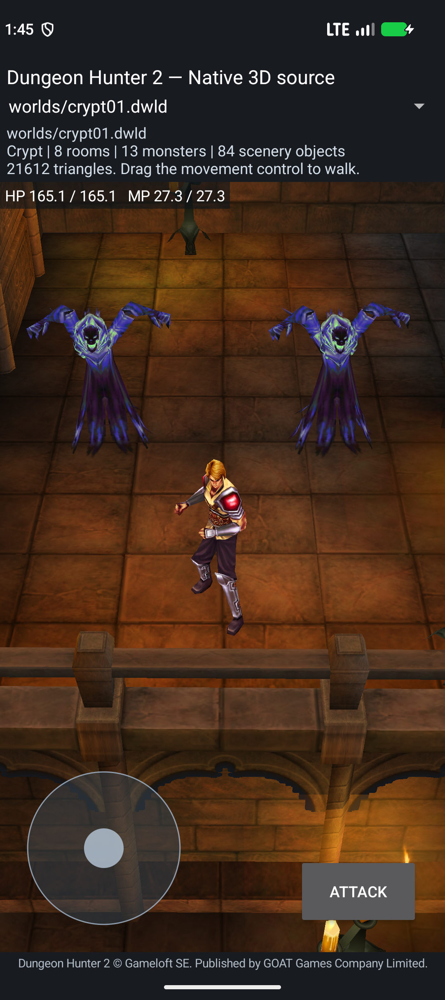
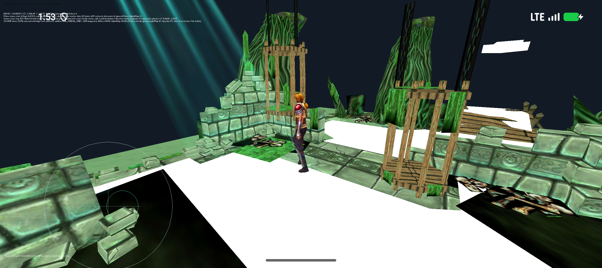

# Source Crypt ambush and Irrlicht actor/physics checkpoint

2026-10-04. Branch: `reconstruction/android17-irrlicht-rebuild-2026-10-03`.
This advances the published `f811f80` Character checkpoint. Its old APKs and
release remain unchanged. The complete combined project brief, Adam comparison
and remaining work are in [COMBINED-RECONSTRUCTION-STATUS.md](COMBINED-RECONSTRUCTION-STATUS.md).

## Actual source advancement

| Work | Implemented source | Verified outcome | Remaining boundary |
|---|---|---|---|
| Original trigger producer | [crypt_spawn_trigger](../port/level-world/crypt_spawn_trigger.hpp) | Source Zone dimensions/scale plus final owner position create absolute bounds; TriggerZone uses inclusive player AABB contact and one-shot gates. | Offline one-player GhostAmbush01 only; generated module placement and other trigger policies pending. |
| Original script session | [crypt_spawn_script_session](../port/level-world/crypt_spawn_script_session.hpp) | Owns complete 15 common/25 Crypt tables, executes supported Wait/Spawn, dispatches Character requests synchronously, rejects unsupported programs before activation, preserves borrowed-table lifetime. | Other script commands, repeated-module object lookup, full ScriptManager ownership pending. |
| Scheduler correction | [script_runtime](../port/script-runtime/README.md) | Original IsBlocking-before-Update order; one update per task/frame; newly executed Wait receives current dt; no overshoot carry. | Bounded capacities and elapsed-overflow policy remain explicit adapter limits. |
| Native level composition | [model_renderer](../port/android-native/app/src/main/cpp/model_renderer.cpp) | ScriptManager precedes physics/actors; contact follows updated player bounds. Reload/rotation preserve consumed trigger and actor states; preview/failure disposal clears owners correctly. | Existing NPCs still use development AI/combat; two source-owned Ghosts have no completed pursuit/combat services. |
| Template RNG selection | [character_template_random](../port/level-world/character_template_random.hpp) | Reuses existing two-stream RNG; uncached positive-count branch draws only ordinary seed/counter. Real cache retains five weighted slots for four Hallway ambushers. | Caller owns startup seed and preceding draw order; host-tested, not yet the live template actor factory. |
| Source visibility correction | [character_state](../port/level-world/character_state.hpp), [original byte proof](../port/level-world/reference/character-spawn-visibility/NOTES.md) | Corrects the vptr address-point error: +0x40 calls SetVisible. Limbus hides; blur restores enabled-byte visibility. Native Ghosts retain that visibility across reload. | General conditions, serialized/network enabled state and all VisualObject synchronization branches pending. |
| Group respawn predicate | [character_group_respawn](../port/level-world/character_group_respawn.hpp) | Limbus gate and Idle/status branches; every member is queried in original order before status1 becomes2. Unsupported states do not read group data. | Native group/member ownership and SpawnFacts wiring pending. |
| Character respawn outer decisions | [character_respawn_outer](../port/level-world/character_respawn_outer.hpp) | InitSpawned suppression byte, property11 gates, nullable group delegation; exact signed shift8/multiply1000 with 32-bit wrap. | Two source decisions; live property/group ownership pending. |
| Limbus timer producer | [character_limbus_respawn](../port/level-world/character_limbus_respawn.hpp) | Prefix visibility/flags, fresh byte530, two independent delay reads, mode/hosting gate, existing Coordinator timer store, normal-flow cleanup. Second delay is not rechecked; timer return ignored. | Host source composition; Android manager/hosting, bytes and respawn-event delivery pending. |
| Limbus blur group producer | [character_group_limbus_blur](../port/level-world/character_group_limbus_blur.hpp) | Role3 only; captured count with live begin pointer, skips owner, queries every other member; any Limbus member selects2. | Post-Revive group branch only; native group ownership pending. |
| Linked aggression cleanup | [character_aggro_cleanup](../port/level-world/character_aggro_cleanup.hpp) | Conditional incoming-link erasures precede owner-map clear; every outgoing peer receives OnDeAggro(owner). Retained peers survive callback registry changes; self peer supported. | One ordering kernel; real map storage, AI/Lua consumers and native ownership pending. |
| SWAMP floor bridge | [swamp_actor_floor_bridge](../port/irrlicht-android/game/swamp_actor_floor_bridge.hpp) | Source module zero maps two floors/99 triangles to Adam's collision/graph view: 133 nodes/430 edges. Mask2 accepts the water floor; mask0 rejects it; void rejected. | Other module/scene/physics ownership pending. |
| Linked Irrlicht actor/physics | [swamp_actor_session](../port/irrlicht-android/game/swamp_actor_session.hpp) | Source root-motion → one NativeWorld Step → Character/actor runtime → pose. Real body bound to source Move focus/blur Unpin/Stop/Pin; free axes, boundary slide and resume pass on Android. | Fixed20ms development clock/input; one player/module0; environment bodies, AI/combat/scripts pending. |

The direct pair `_prim_Monster_SURPRISE_01/02` belongs to **GhostAmbush01** in
`crypt_straight_c_ns_01.mgp`. **GhostAmbushHallway** in `crypt_straight_ns_01.mgp`
spawns four separate weighted-template actors. Historical shorthand conflating
those paths is corrected here.

## Original-to-source mapping

The [cumulative function map](generated/character-runtime-function-map.json)
now verifies **82 unique original ranges**, from **101 evidence records across
eleven manifests**. It adds **58 addresses** to Adam's pinned 1,455-address ledger:
**1,513 combined unique addresses**. Duplicate evidence is merged by address;
each range's original bytes, aliases, source paths and implementation limits
are preserved. These are evidence mappings; they do not count completed function bodies.

Key new verified ranges:

| Original function | ELF start | Current source coverage |
|---|---:|---|
| Level::Update | `0x3f82d8` | ScriptManager-before-physics/ObjectManager phase evidence; full Level body pending. |
| ScriptManager::ExecuteScript | `0x45c16c` | Wait blocking/update/return and supported command sequencing. |
| ScriptManager::ExecuteAllScripts | `0x45c37c` | Start-of-update task snapshot; child contexts wait until next update. |
| Script_Wait::IsBlocking / Update / Execute | `0x455754` / `0x4597b4` / `0x45c438` | Duration, reset and frame quantization. |
| Script_SpawnCharacter::Execute | `0x45f400` | Existing uniquely named Character request, not allocation. |
| GameObject::SetRelativeAABB / UpdateAbsoluteAABB | `0x38b110` / `0x38aac8` | Crypt box copy/translation; its dimensions avoid the small-extent padding branch. |
| Character::SafeGetCharPropsId | `0x3b3d38` | Ordinary RNG draw for uncached positive-count template selection; other branches pending. |

Pseudocode export addresses for these functions are rebased by `+0x10000`.
The manifests use original ELF addresses and complete-range byte hashes.

## Exact build and runtime proof

Native development APK SHA256:
`df7252602307143fe4d58a95510ea2626a09023a09466bfc827fb8cf5de5bfc8`.

Local artifact: `port/android-native/app/build/crypt-source-script-candidate.apk`
(23,631,124 bytes).
It includes ARM64/x86_64 ELF64 code and **240 bundled assets**. Gradle succeeds;
runtime inspector verifies every native library's minimum LOAD alignment is
16 KiB; APK ZIP alignment and signature verification also pass. The installed
APK's SHA256 equals this local artifact's SHA256. [Artifact validation](../reports/reconstruction-2026-10-04/crypt-script/artifact.json)
records source and every packaged asset/library hash.

On Android 17/API37 `emulator-5558`, `PAGE_SIZE=16384`:

- Normal bundled player start does not accidentally activate the distant ambush.
- A temporary player-start mod places the Prince outside the original trigger.
  Actual joystick/root-motion travel enters it. Trigger geometry and original
  script tables remain unchanged; no debug Spawn command is used.
- Source Wait250 and Wait75 dispatch both exact-name requests. Observed manager
  clock values were 4957 and 5035 ms; Wait start frames were 4695/dt16 and
  4957/dt18. These are recorded frame observations, not promises of wall-clock
  or unquantized dispatch intervals.
- Both original finite Spawn clips complete into Idle; each creates one native
  body. Screenshots show both ghosts and the Prince.
- Source visibility hides both fresh Ghosts, then restores their enabled-byte
  visibility before Spawn. Invisible Limbus actors still update timers; hiding
  no longer bypasses the entire actor update.
- Direct world reload and Activity rotation retain activation count1/request
  count2 and Idle actors, with no script or Spawn replay.
- Legacy NPC-to-Ghost, Ghost-to-NPC and Ghost-to-player combat target requests
  reject before mutation. The command survives Activity surface recreation;
  pending target-only commands are no longer dropped. This guard is an explicit
  integration boundary until Ghost combat services are connected.
- Log capture starts at each launch timestamp to exclude unrelated older
  system logs when Android reuses a process ID.
- The prior world override and emulator rotation preference are restored.

Reproduce with [crypt_script_runtime_smoke.py](../port/android-native/tools/crypt_script_runtime_smoke.py).
Reports: [runtime](../reports/reconstruction-2026-10-04/crypt-script/runtime.json),
[session](../reports/reconstruction-2026-10-04/crypt-script/session-host.json),
[trigger](../reports/reconstruction-2026-10-04/crypt-script/trigger-host.json),
[template RNG](../reports/reconstruction-2026-10-04/crypt-script/template-random-host.json),
[SWAMP bridge](../reports/reconstruction-2026-10-04/crypt-script/swamp-floor-host.json).

Additional source checks: [reader/live linking](../reports/reconstruction-2026-10-04/crypt-script/reader-runtime-boundary-host.json),
[group respawn](../reports/reconstruction-2026-10-04/crypt-script/group-respawn-host.json),
[aggression cleanup](../reports/reconstruction-2026-10-04/crypt-script/aggro-cleanup-host.json).

New source-only checks: [outer respawn](../reports/reconstruction-2026-10-04/crypt-script/respawn-outer-host.json)
(29 cases), [Limbus timer producer](../reports/reconstruction-2026-10-04/crypt-script/limbus-respawn-host.json)
(14 cases), [Limbus blur group producer](../reports/reconstruction-2026-10-04/crypt-script/group-limbus-blur-host.json)
(16 host cases and 7 original ARM branch cases). These kernels are not yet
bound to the native app's complete respawn/group/AI ownership.

## Irrlicht source actor/physics runtime proof

APK SHA256 `2e3464ef63bf9af57bb06ca40bca14b8024be210195f74ea0668f1ea95aa0967`,
72,059,578 bytes. ARM64/x86_64 build, native alignment, ZIP alignment and signature
checks pass. The installed APK matches the built artifact. All 130 recorded
source hashes match the tested workspace.

The independent [host composition](../reports/reconstruction-2026-10-04/crypt-script/swamp-actor-session-host.json)
passes 34 frames/34 world steps with the actual resolved224-property sheet.
It verifies Stop→Pin callback order, unpin, duplicate binding/reload rejection,
detach-before-teardown and safe subsequent Character updates. Measured body
radius is 116.556 source units.

The [Android runtime](../reports/reconstruction-2026-10-04/crypt-script/irrlicht-swamp-runtime.json)
passes on API37 with page size16384:

- +X and -Y free movement use source Walk1126 and return to original Idle.
- A separate +Y sweep moves freely before PF validation redirects along +X.
  Two measured slide samples retain Y=-198.584 while X advances1342.642→1397.800;
  desired input is +Y, validated direction is +X, and source owner motion agrees.
- Source body remains present; held movement dispatches one unpin, release
  dispatches Stop then pin, and Idle clears its route without position drift.
- Every logged actor counter equals its world-step counter; body XY matches
  source owner XY/100. The renderer presents actual source-skinned poses.
- HOME/resume retains the same process, visible full Prince and Idle position
  (1578.938,-198.584,255). This does not prove process-death saves.

Manual inspection confirms head-to-feet rendering in Walk, edge-stop and resume.
White floor bands and dark material patches remain visible. The session owns
one player body; it does not load environment wall/decor bodies or other module
seams. Navigation edge sliding is not evidence of complete collision gameplay.
The logical20ms tick is a development producer; original clock parity is pending.

## Next enemy source integration

The actual direct Ghost CharacterTable variants35/37 resolve AIProps68, named
`Ugly_Dog`, Type4, with Script=`monster`. The plain name selects `AISExternal`
and the unchanged recovered `data/scripts/ai/monster.luac`. Its registered
`monster_OnEnemySpotted` handler queries HasTarget, then SetTarget and HeadTo;
its out-of-range handler has original Idle/path gates before MoveTo. Built-in
`AISMonster` is selected by a different `__monster__` name. Candidate search,
external VF callback dispatch and stable actor ownership must be reconstructed
and connected before these Ghosts can pursue or fight. This is an audit finding,
not a behavior proven by the current APK.

## What remains

Full game reconstruction remains active. The next integration work is the
remaining Irrlicht world/body ownership, live template construction, original
enemy pursuit/AI/combat, group/respawn and linked-aggro ownership. Complete level
flow, procedural generation, campaign quests/rewards, inventory/skills, UI,
audio/effects, process-death saves and physical current-Android ARM64 gameplay
remain completion gates. This checkpoint proves one original ambush path.
