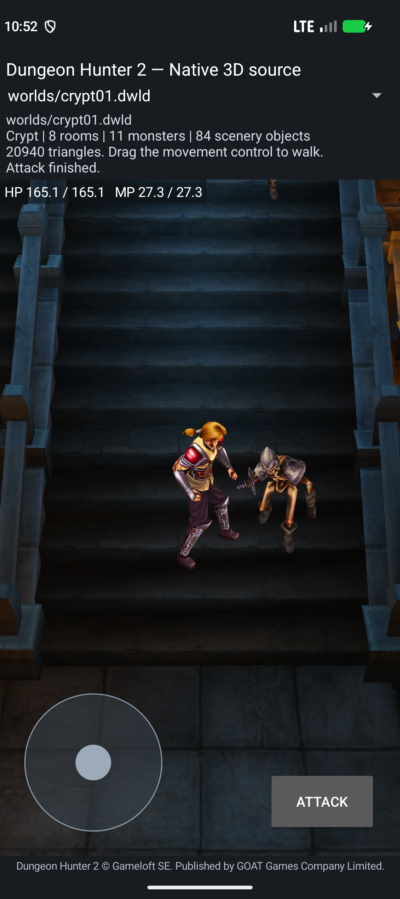

# Native Crypt continuation build — 2026-10-04

This checkpoint combines Adam's pinned native Crypt project with the initial
fan asset override loader and attack-status repair.
It is a source-built development app, not a finished Dungeon Hunter 2 release.

## Build and artifact

- Project: `port/android-native`, API 37, NDK `29.0.14206865`.
- Command: `gradlew.bat --no-daemon --console=plain :app:assembleDebug`.
- Artifact: `port/android-native/app/build/outputs/apk/debug/app-debug.apk`.
- Size: 23,558,662 bytes.
- SHA-256: `9bf6d31264a577bdfa71e82a1f17e89b622c9602f4c6ea4f96c9281d44824ac3`.
- ARM64 and x86_64 native libraries are built from the checked source; no ARM32
  game engine or translation runtime is packaged by this project.
- The APK inspector checked all 16 ELF64 libraries and at least 16 KiB LOAD
  alignment; the emulator installed APK hash matched the candidate.
- SDK 37 `zipalign -c -P 16 -v 4` also passed on this exact APK.

Historical earlier APK hashes in `ADAM-WORK-COMPARISON.md` identify different
builds. They must not be applied to this APK.

## Runtime verification

Only `emulator-5558`, Android 17/API 37 x86_64, `getconf PAGE_SIZE=16384`, was
used. No Fold7 or 4 KiB runtime test was run for this checkpoint.
Fingerprint: `google/sdk_gphone16k_x86_64/emu64xa16k:17/CP41.260828.004.A7/16296984:userdebug/dev-keys`.

`prince_bank_smoke.py` passed on this exact APK:

- Authored Crypt loading and visible animated Prince.
- 116 animation resources / 158 registration occurrences / both playback slots.
- Actual touch walking and running, release to idle, source body/pose updates.
- Whole-actor freeze preserved scene/physics/pose clocks and pixels; resume advanced.
- Touch movement through development waypoints reached `_prim_tmp_cultist07`.
- Attack selected source state 5, dispatched authored events and returned to idle.
- Three actual hit applications reduced target HP `12160→11901→11728→11556`.
- Activity recreation preserved the position `(-1403.8174,-384.9354,185.3827)`
  and reselected the source Idle sequence.
- No fatal/GL/native-load errors appeared in the smoke's filtered app logs.

The test uses development controls and a chosen target. It does not prove full
enemy pursuit, original AI/FSM ownership, the full campaign, all animation-pose
equivalence, GPU fidelity, persistent campaign saves or physical ARM64 gameplay.
The UI originally retained “Attacking” after the finite native sequence ended;
it now observes the native character state and displays “Attack finished.”



This screenshot is from the exact APK above on the 16 KiB emulator, after the
finite attack completed. The Prince, selected skeleton, level and development
controls are visible; the UI reports `Attack finished.`

## Fan override verification

`check_mod_assets.py` passed host path, missing-file, successful override, size,
non-file and retained-output checks. Host symlink creation was unavailable.

`mod_assets_smoke.py` passed on the same API 37/16 KiB emulator:

1. Loaded baseline spawn `(-2227.77,1220.9301,842.3644)`.
2. An external `worlds/crypt01.dwld` override changed X to `-2127.77`; the
   actual native body/world initialized at the modified location.
3. A malformed override reported `World descriptor rejected` without a crash.
4. Removing the override restored the baseline. Previous override bytes, if
   present, were preserved/restored by the test.

See [MODDING.md](../port/android-native/MODDING.md) for the supported boundary and
remaining mod API/installation work.

## Evidence

The pending Infected Village actor registry, SWAMP script scheduler and Ambush
trigger-to-actor host slice were also rebuilt and checked during consolidation.
The registry preserves 26 source actors and the unresolved `_prim_tmp_infected17`
lookup; the SWAMP scheduler checks nine modules and 148 source records. These
host checks preserve their explicit approximation/service limits and do not
establish live quest/trigger integration in the Crypt app.

Published structured results: [`reports/reconstruction-2026-10-04`](../reports/reconstruction-2026-10-04).
Full local logs/screenshots remain in ignored app build folders:

- `app/build/combined-final-prince-smoke/` — final gameplay/lifecycle results.
- `app/build/combined-mod-smoke/` — override/rejection/baseline-recovery results.
- `app/build/combined-mod-build.log` — compiler output.

The source APK remains available at the artifact path above. Local debug hashes
can vary after another build; every subsequent test must record its own APK hash.

## Separate Irrlicht source actor checkpoint

- Artifact: `port/android-app/build/irrlicht-swamp-prince-preview/dh2-swamp-irrlicht-source-local-debug.apk`.
- Size: 70,054,398 bytes.
- SHA-256: `eeb3b1932b5584c1d9766bfc86e239ab3edfd9f4033407bfb4e2424491dfe9a0`.
- Package: `local.dh2.sourceviewer.irrlichtswamp`.
- Source-built ARM64/x86_64 libraries, pinned Irrlicht OGL-ES r6038, 16 KiB alignment and APK package/signature checks.
- Player sphere replaced with four source warrior skins: 27 joint references,
  487 vertices, 586 triangles and four mapped atlas materials.
- Source primitive semantic mappings, immutable bind positions, source Idle/Walk,
  skin palettes and Adam's `visual_motion::SceneBinding` feed mutable Irrlicht meshes.
- Explicit source ONE/ONE ADD blending and depth-write-off map the two
  `Material__11598` overlay draws; geometry is retained.

The first candidate `54301988…` passed numeric/movement logs but failed manual
inspection: the Idle head was clipped, Walk disappeared and a broad opaque-black
overlay covered the scene. The corrected APK above passed both axes, release to
Idle and same-process HOME/background/resume on API 37/16 KiB. Manual inspection
confirmed the full Prince in Idle, Walk and resume, and the broad overlay was
gone. Resume retained source position `(1099.104,-203.522,255)`.

The current development camera and first-Idle placement offset are explicit
adapters. Original Character scale/heading/full bank/state ownership, wall/swept
collision, AI/combat in this route, native shaders/lighting, white fallback floor
regions and remaining dark material patches are unfinished. This is a renderer
and movement checkpoint, distinct from the Crypt combat app above.

Reproduce the host gate:

```powershell
python port/irrlicht-android/game/tests/run_prince_host.py --assets port/android-native/app/src/main/assets
```

Reproduce the runtime gate on the 16 KiB emulator:

```powershell
python port/android-app/tests/irrlicht_swamp_native_runtime.py --apk port/android-app/build/irrlicht-swamp-prince-preview/dh2-swamp-irrlicht-source-local-debug.apk --adb <sdk>/platform-tools/adb.exe --serial emulator-5558 --output port/android-app/build/irrlicht-swamp-prince-preview/runtime-final-16k --require-prince
```

See [the build helper documentation](../port/irrlicht-android/swamp-smoke/README.md),
the [host result](../reports/reconstruction-2026-10-04/irrlicht-prince-host.json)
and [runtime result](../reports/reconstruction-2026-10-04/irrlicht-prince-runtime.json).
