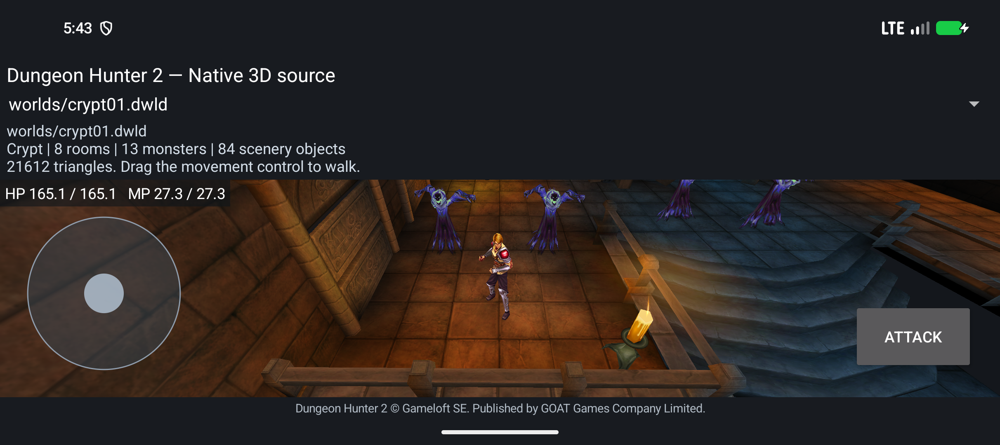

# Native Character query and initialization checkpoint — 2026-10-04

Branch: `reconstruction/android17-irrlicht-rebuild-2026-10-03`.
Adam reference: `45c5348e807607a2825211bb8f26248067ba9106`.

## Tested build

APK: `crypt-native-character-query-init-candidate.apk`, **24,305,912 bytes**.
SHA-256: `88fd31818f6edeee68a7685ac90786015b483d4ae67aa0beeb0b25f116c4e59f`.

This source-built Crypt development app renders the original world and Prince,
runs the original ambush and monster OnInit, and retains the same VM and damaged
health through reload and Android activity recreation. Autonomous enemy AI,
complete skills, combat and campaign flow remain unfinished.

Both ARM64 and x86_64 build successfully. The APK passes signing and 16 KiB
ELF/ZIP alignment checks: 16 ELF64 libraries, 248 assets, 48 bounded source
AI/script units and 78 export groups. Its **440 actual repository compiler/build
inputs** were unchanged through the build. No original ARM32 game library is
loaded. Physical ARM64 execution has not been tested.

The exact raw compiler inputs are preserved in
`crypt-native-character-query-compiled-source.zip`: 846,188 bytes, SHA-256
`8ddc3d19c68d752cf642cdeede50fe0243fd94532f5cfbbbd5b5351e11701303`.
This archive preserves build bytes across Git line-ending normalization. It is
not a standalone SDK, complete asset bundle or full-game reconstruction.

The APK is smaller than the preceding 27,349,040-byte build because unused gaps
in the incremental ZIP were removed. The asset entry set and every asset byte
are unchanged; the native libraries grew slightly.

## What changed

| Source work | Evidence | Integration in this APK |
|---|---|---|
| Owned flat Character list | Source manager/list helpers and host ownership checks | Prince plus 13 monster projections enrolled in 14 owned nodes. No copied room links; full ObjectManager factory remains pending. |
| TargetList point query | Five complete original ARM executions compared with compiled host query; all 13 popped records and 61 service/mutation events match | The corrected query is linked. Autonomous Ghost queries are not yet invoked. Active diagnostic-switch override is excluded. |
| Callback-order bug fix | Original code calls IsZonable and IsInteractive on a visible non-Character before rejecting a null GetChar | The linked query now follows this order. This was found by comparing actual original instruction execution. |
| AIS OnInit/Post/Final | 22 host and 21 original ARM cases | OnInit remains live. Post/Final providers are compiled but wait for skill initialization. |
| Same-VM Post/Final dispatch | 32 host groups, including fresh alias replacement and discarded return behavior | Compiled; Post/Final not dispatched early. |
| Character::_InitHpMp | 17 host, 10 guard, six failure and 32 original ARM cases | HP-then-MP source caller compiled; production phase not invoked yet. |
| Live property/Debug HP/MP adapter | 50 host groups, including real file errors and callback mutation; 18 unchanged positive OnInit cases | Existing SetLevel is live. The new initial-vitals adapter is compiled and awaits InitScriptProcess. |
| Flat list → Lua → path ownership | 19 Ghost session and 20 native owner host groups | Compiled; native autonomous frame services remain pending. |
| F_DotAttack and bounded F_ApplyResult | Independent original ARM/host reports | New source code only; unlinked. Offline nonplayer result handling is bounded and lacks complete combat dependencies. |
| UsingSkill/Casting predicates | 156 original ARM comparisons, 106 host calls and 13 guards | New source code only; unlinked. Source state IDs are 6 and 7. |

## Actual app test

The exact installed APK passes on **Android 17/API37, x86_64, 16,384-byte pages**.
The temporary fan start fixture allows actual touch/root-motion movement into
the authored GhostAmbush01 trigger. Original trigger and Lua files are unchanged.

- Original timed spawning creates two Ghost bodies. Both run OnInit once:
  Level raw 2048, HP/max 25600, MP/max 23552, flags `0x183c`.
- A debug-only nonlethal health fixture applies raw damage 256: HP becomes
  25344. This is health integration evidence, not complete combat.
- Reload and rotation preserve damaged health, VM identities, initialization
  counts, consumed trigger state and both source timer slots.
- AI/DoT event timers `0x33/0x34` remain explicitly paused at durations
  3000/1000 ms. Their unfinished providers do not silently consume events.
- All seven Character-list observations report 14 Characters and 14 owned nodes.
- The real 665-byte private Debug file survives recreation. Counters report
  one load, five saves, balanced closes and zero I/O errors.
- All 33 FastTravel and 51 Level rows load; three original range callbacks pass.
- Three unsupported combat target pairs reject. The test then returns camera
  focus to the Prince; root inspected the final screenshot with the full Prince
  and textured Ghosts visible.

An initial camera-reset assertion expected one particular Activity log message.
Activity recreation legitimately produced a different message. The assertion
was corrected, and the same APK passed the complete rerun.

Evidence: [runtime](../reports/reconstruction-2026-10-04/native-character-query-init/runtime/crypt-script-smoke.json),
[artifact](../reports/reconstruction-2026-10-04/native-character-query-init/artifact.json),
[ABI exports](../reports/reconstruction-2026-10-04/native-character-query-init/abi-exports.json),
[compiler inputs and 380 component hash checks](../reports/reconstruction-2026-10-04/native-character-query-init/frozen-inputs.json).

## Next implementation steps

1. Connect real Skill/Faery table ownership and live property IDs to
   SetSkillsAndSpells. Original Ghost data selects an empty ordinary skill list
   and five faery rows whose SpellScript lengths are zero. Their readable names
   are not script filenames. Preserve the five null vector entries.
2. Finish source InitScriptProcess: HP/MP, skills, UpdateAllSkills, Post and
   optional Final in the original order. Preserve the same published VM through
   graphics recreation. Nonempty skill scripts need real Lua loading/calls and
   native pointer ownership.
3. Bind the actual flat list to native acquisition, target/master/frame/path
   and body services. Test enemy pursuit and attacks in the app.
4. Complete damage/result/death/loot/respawn and finish one original level through
   its exit. Then connect remaining factories, generation, transitions, quests,
   progression, UI, audio/effects and persistent campaign saves.
5. Document fan changes and validate clean source builds, sustained gameplay
   and physical current-Android ARM64 execution.

The full-game goal remains active. Function mappings, test cases and code size
do not establish a game-wide completion percentage.
