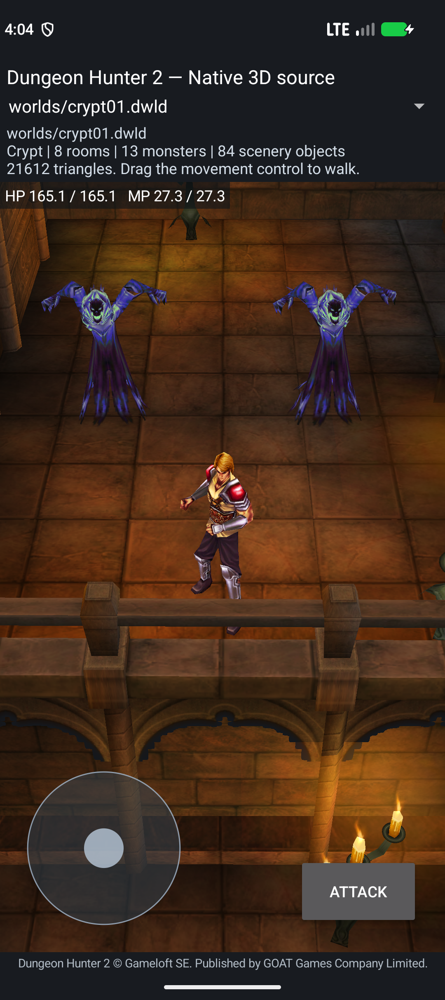

# Native monster initialization checkpoint — 2026-10-04

Branch: `reconstruction/android17-irrlicht-rebuild-2026-10-03`.
Adam reference: `45c5348e807607a2825211bb8f26248067ba9106`.

## Build and scope

Development APK: `crypt-native-monster-on-init-candidate.apk`, 27,349,040 bytes.
SHA-256: `46e372a41d900666ed17899bb62674f3bf68c1b35212c2251f974359406465ab`.

This is a source-built Crypt development app. It renders the original world and Prince, runs the authored ambush script, creates two Ghost bodies, and now executes their unchanged original monster OnInit against live native properties. Autonomous Ghost AI, complete skill initialization, combat and campaign flow remain unfinished.

Both ARM64 and x86_64 builds pass: 16 ELF64 libraries, 16 KiB ELF/ZIP alignment, signing, 44 bounded AI/script units and 66 required export groups. The 430 actual repository compiler/build inputs were unchanged through the build. Their raw bytes are preserved separately in the compiled-source archive, because Git can normalize line endings. The APK contains 248 assets and does not load the original ARM32 game library.

The archive is 807,445 bytes, SHA-256 `cddfd5777ece9c59ff47c2dc1b60f380980c8236923141f5d390cb2651309879`. These are actual build inputs, not every recovered source or every newly reconstructed unlinked kernel.

## What changed in the actual app

1. Native initialization retains the real class table, property field names, design constants and private DebugSwitches file backend.
2. Source AIS construction creates one VM; 35 AIS functions bind before the supported Character functions. Source association and script loading precede OnInit. The source callback membership flags and active/pending publication use that same VM.
3. Original monster OnInit selects Crypt level 8, calls the reconstructed SetLevel/class recalculation/regeneration, and fills Ghost HP/MP using live native properties. The bounded managed PlayerInfo level fallback now reads the real owned Prince Level. Profile/network/save ownership remains incomplete.
4. Stable shared native AI storage and spawn ownership retain the initialized VM through scene reload and Android window recreation. OnInit does not run again or heal a damaged Ghost during those operations.
5. Two source timers are created in order, with event IDs 33/34 and durations 3000/1000. Both are explicitly paused until their real AI/DoT providers are connected. They are not silently consumed by a partial FSM.
6. Android FORTIFY exposed a Lua weak-table GC string scan during native registration. The bounded replacement preserves embedded-NUL semantics; real GC regression tests and the corrected Android run pass. See [adaptation details](../port/adam-script-runtime/ANDROID-GC-ADAPTATION.md).

## Exact Android test

The exact installed APK passes on Android 17/API37 x86_64 with `PAGE_SIZE=16384`.

- Actual touch/root-motion movement enters the original GhostAmbush01 trigger using the labeled temporary fan start fixture. Original trigger and Lua files remain unchanged.
- The timed script creates two source Spawn requests and native Ghost bodies. Both run original OnInit once: Level raw 2048, HP/max raw 25600, MP/max raw 23552, source flags `0x183c`.
- A debug-only nonlethal fixture invokes the existing bounded HitFor health kernel with raw damage 256. HP becomes 25344. This tests health retention; it does not prove full combat damage calculation.
- Reload and rotation preserve that damaged health, VM identities, initialization counts, timer IDs/durations/elapsed values and consumed ambush state.
- The real 665-byte private DebugSwitches file is unchanged after recreation. Source I/O counters show one load, five saves, balanced read/write closes and zero I/O errors.
- The viewport still loads all 33 FastTravel and 51 Level rows and returns Crypt ranges `8–10 / 45–47 / 74–76` through the original callbacks.
- Three gated combat target pairs reject explicitly. Full Character registration (265 original bindings), SetSkillsAndSpells, post/final initialization and autonomous frame execution remain pending. Physical ARM64 gameplay has not been tested.

Root inspected the screenshots: the Prince, Crypt scenery and textured Ghosts remain rendered after rotation.

Evidence: [artifact](../reports/reconstruction-2026-10-04/native-monster-initialization/artifact.json), [runtime](../reports/reconstruction-2026-10-04/native-monster-initialization/runtime/crypt-script-smoke.json), [ABI exports](../reports/reconstruction-2026-10-04/native-monster-initialization/abi-exports.json), [actual compiler inputs](../reports/reconstruction-2026-10-04/native-monster-initialization/production-build-snapshot.json), [component hashes](../reports/reconstruction-2026-10-04/native-monster-initialization/frozen-inputs.json).

## Source reconstruction advanced alongside the build

Each report records source hashes and provider boundaries. Linked code is not automatically live gameplay.

| Component | Independent evidence | Current integration |
|---|---|---|
| Live SetLevel adapter | 42 host cases; 18 unchanged positive OnInit catalogue cases | Live in Android with class/design/property/Debug/file providers. |
| Native Debug file backend | 20 host cases, real file load/save/error effects | Live in Android private storage. |
| PlayerManager hosting level | 12 host cases; 10 original ARM lookup/reconciliation/constructor scenarios | Bounded native owned level fallback; full profile/network path pending. |
| AIS staged session | 30 host groups | One source-created VM, split binding order and source publication live. |
| UpdateAllSkills | 14 host and nine ARM cases, zero mismatches | Linked; native skill producer/frame invocation pending. |
| CharacterList | Three host suites; original iterator virtual sequence and TargetList call boundary | Source only. The real aggro producer is the flat ObjectManager Character list. Full point-query oracle pending. |
| GetCharFaery | 12 host and five ARM cases, zero mismatches | Source only; source fallback list can select five faeries, so empty ordinary skills cannot justify skipping faery initialization. |
| CharAISkillScript constructor | Nine host and four ARM cases, zero mismatches | Source only; real Arguments, DeclareSkill, Load and growth remain separate providers. |
| HandleDots | 36 host, 19 guard, 48 failure checks; 149 original ARM comparisons | Complete 144-byte caller, source only. Positive ticks require F_DotAttack and F_ApplyResult. |
| Lua GC platform adaptation | Eight weak-mode cases and 8,000 real native registrations | Corrected Android runtime passes. No original whole-VM parity claim. |

All ten component reports passed 266 checks against current source hashes before freezing. Older published reports retain their historical inputs. A pre-fix Android crash, a health-check timing assertion error and a transient ADB daemon failure were investigated before the final passing run; none is represented as a passing test.

## Remaining work and next implementation goals

1. Complete real skill/faery creation and Lua loading; finish source InitScriptProcess post/final stages and Character bindings.
2. Connect the actual ObjectManager flat Character list, stable enrollment/removal, source acquisition, target/master/frame/path and body services. Exercise Ghost pursuit in the app.
3. Complete DoT/result providers and enemy/player attacks, health, death, loot and respawn; finish one original level through its exit.
4. Integrate remaining factories, level generation/transitions, quests, progression, UI, audio/effects and persistent campaign saves.
5. Document fan data/script/asset changes and validate clean native builds plus sustained gameplay on a current Android ARM64 device.

The full-game goal remains active. No game-wide completion percentage is supported by the present evidence.
