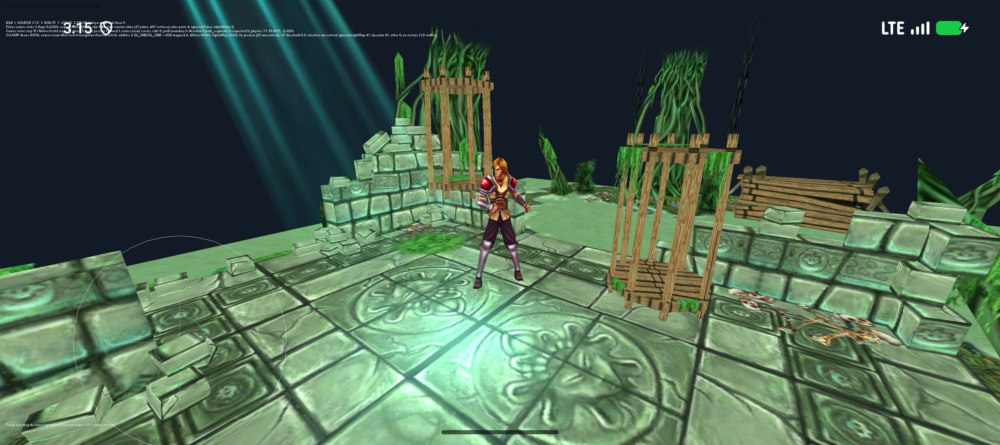
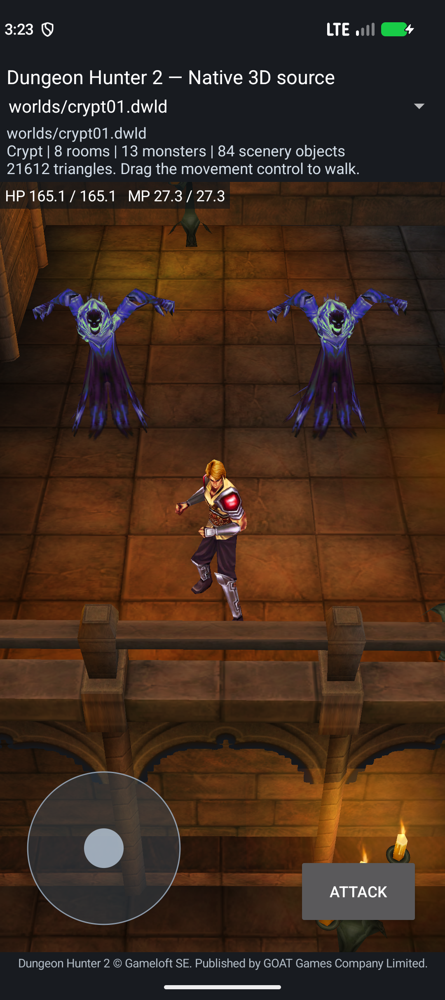

# Source acquisition and shader checkpoint

This extends the [nine-unit AI/room checkpoint](SOURCE-AI-ROOM-CHECKPOINT-2026-10-04.md). The [combined report](COMBINED-RECONSTRUCTION-STATUS.md) contains the improved project brief, Adam comparison, mapping inventory and complete roadmap. Earlier artifacts and reports retain their original identities.

## Runnable Irrlicht build

Local APK: `port/android-app/build/irrlicht-swamp-source-alpha-preview-candidate/dh2-swamp-irrlicht-source-local-debug.apk`.

- Bytes: **72,063,674**.
- SHA-256: `8128690371730354e403e2b10fec330b8c712d3d0c8a3bfd61daa6f5c3e6e011`.
- Android 17/API37/x86_64, `PAGE_SIZE=16384`; built and installed hashes match.
- Source ARM64 and x86_64 libraries are packaged. Physical ARM64 gameplay remains untested.

The original diffuse shader reads the AlphaMap's **blue channel**, whereas the earlier adapter copied decoded alpha. Those channels differ at 124,368 of 1,048,576 texels. The previous alpha-reference material also rendered without blending at a zero threshold, producing opaque dark cards around ground details and foliage.

The corrected adapter copies the blue mask into diffuse alpha and chooses Irrlicht's fractional-alpha blend path for the 22 resolved `Material__11611` draws. The source shader's `AL` and `AT` variants differ: `AT` discards below 0.8. The serialized type-20 technique value has not yet been decoded, so this build explicitly labels its choice **AL preview**. Original AL/AT selection and original blend/depth state are unresolved. Unresolved `Material__11610` AlphaMaps remain unchanged.

The [audit](../port/irrlicht-android/reference/swamp-render-material-audit/NOTES.md) pins original archive members and hashes without duplicating shader text. [Host evidence](../reports/reconstruction-2026-10-04/source-alpha-preview/host.json), [build evidence](../reports/reconstruction-2026-10-04/source-alpha-preview/build.json) and a [131-input snapshot](../reports/reconstruction-2026-10-04/source-alpha-preview/production-build-snapshot.json) bind the correction to the tested APK.

[Android tests](../reports/reconstruction-2026-10-04/source-alpha-preview/runtime.json) passed free movement, navigation-boundary sliding, source Walk/Idle, Move unpin, Stop then pin, equal actor/world-step counters, and same-process HOME/resume. No scoped fatal markers occurred. Geometry remains 10,816 vertices/13,284 indices, with 49 scenery draws and the original navigation inputs retained. Root visually inspected initial, boundary-held and resumed screens and compared the starting view against the previous APK. Opaque dark rectangles are visibly removed; full shader/lighting/camera fidelity is still pending.

## Additional source reconstruction

| Original anchor | Maintained source | Implemented boundary | Root verification |
| --- | --- | --- | --- |
| `_UpdateAggro`, `0x3cf3f0` entry and normal-acquisition prefix | [acquisition prefix](../port/level-world/character_aggro_acquisition_prefix.cpp) | Fresh Player/Faerie/NPC/Monster/remote queries, reused source timing/RNG, captured AI table and selected radius. Already-target branch returns an explicit boundary. | [45 host + 40 original ARM cases](../reports/reconstruction-2026-10-04/source-ai-acquisition/character-aggro-acquisition-prefix.json), zero mismatches |
| `AI_IsInSight`, `0x3d4ea0` and `0x3d4ed8` | [sight queries](../port/level-world/character_ai_sight.cpp) | Null fallback, borrowed positions read after both callbacks, fresh owner/table query, exact binary32 operation order and strict comparison. | [32 host + 35 original ARM cases](../reports/reconstruction-2026-10-04/source-ai-acquisition/character-ai-sight.json), zero mismatches |
| `_UpdateAggro` local Monster target branch | [monster retarget](../port/level-world/character_monster_retarget.cpp) | Highest-threat selection, source threshold and target switch; non-enemy clear/SetTarget/SyncLastTarget ordering. Enemy-retention search returns an explicit boundary. | [28 host + 33 original ARM cases](../reports/reconstruction-2026-10-04/source-ai-acquisition/character-monster-retarget.json), zero mismatches |
| Source search/event/external-AIS/target/controller chain | [actor-owned Ghost composition](../port/level-world/ghost_ai_session.cpp) | Separate retained Lua sessions, stable owner/AI/AIS identities, actual source search and event consumers, source target mutation and controller path dispatch. Host integration over borrowed game services. | [Eight host case groups](../reports/reconstruction-2026-10-04/source-ai-acquisition/ghost-ai-session.json), zero mismatches |

These are bounded caller implementations with typed, borrowed game-service interfaces. Supporting handle, Character, table, debug, relationship and aggression services are not all newly reconstructed bodies. Original instruction comparisons explicitly model external soft-float imports; NaN payload propagation is outside the claim. The host ARM oracles are component comparisons, not Android game emulation.

The [cumulative function map](generated/character-runtime-function-map.json) verifies 150 distinct original ranges across 218 evidence records/24 manifests. It extends Adam's 1,455-address ledger by 86 distinct addresses, giving 1,541 combined unique addresses. Evidence reach does not measure completed source functions or game completion.

The Ghost composition verifies independent actor globals, stale-owner rejection, callback rebinding, partial path failure, empty searches, fresh AI target reads and alias guards. The original event `0xC` calls virtual `OnTargetOutOfSight()` without an argument. The candidate producer's target payload is deliberately not forwarded by that dispatcher; the original vtable entry at address point +0x48 resolves to `0x3d2410`. This finding prevented an incorrect change to the already-tested dispatcher.

## Runnable thirteen-unit Crypt build

Local APK: `port/android-native/app/build/crypt-ai-thirteen-source-candidate.apk`.

- Bytes: **24,822,127**.
- SHA-256: `1193fa7d098e324263046422cff4faedff52d97271e7f3e470cf2012d7006891`.
- [Build validation](../reports/reconstruction-2026-10-04/source-ai-acquisition/crypt-artifact.json): 243 assets, 16 source libraries, ZIP/load alignment and signing pass. The two unchanged original monster AI scripts are now packaged with cache provenance.
- [Production snapshot](../reports/reconstruction-2026-10-04/source-ai-acquisition/crypt-production-build-snapshot.json): all 48 targeted source inputs remained unchanged through the build and match the artifact validator.
- [Native exports](../reports/reconstruction-2026-10-04/source-ai-acquisition/crypt-source-exports.json): thirteen AI/script units exported for ELF64 ARM64 and x86_64, with one reused Adam Lua core per ABI.
- [Android runtime](../reports/reconstruction-2026-10-04/source-ai-acquisition/crypt-runtime.json): API37/16KiB, matching built/installed hash, actual touch travel into the authored ambush, original timed Spawn requests, source visibility/body creation and reload/recreation preservation all pass.

Root inspected the fresh Ghost-pair screenshot. The compiled AI units and packaged scripts are **not yet wired to live enemy pursuit** in this APK. Unbound Ghost combat pairs remain rejected; physical ARM64 gameplay and complete-level playthrough remain untested. The player-start override is explicitly a fan test configuration, and the original trigger/script bytes remain unchanged.

## Work proceeding

1. Connect the tested actor-owned search/event/Lua/target/controller composition to genuine live Android actor services and an actor-owned route follower.
2. Finish the already-target enemy-retention search and the turn/timer/target/master producers.
3. Verify authored spawning followed by acquisition, pursuit and attacks, with two independent Ghost sessions and lifecycle restoration.
4. Decode the original shader technique selection and complete the remaining engine/rendering behavior.
5. Continue object factories, generated levels, campaign/UI/audio/progression, persistent saves, fan modding and physical ARM64 gameplay.

The full native source-rebuild goal remains active. This checkpoint establishes tested source behavior and an improved runnable development build; it does not establish complete campaign playability.
