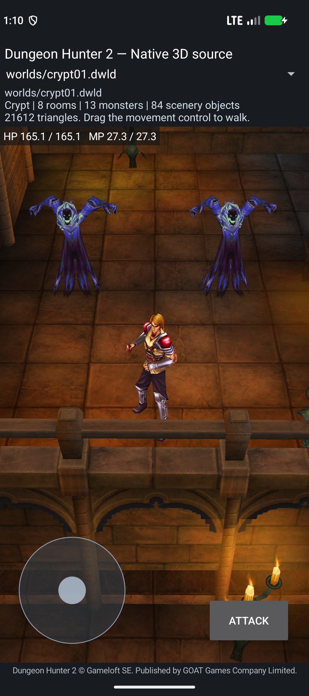

# Source AI lifecycle checkpoint — 2026-10-04

Branch: `reconstruction/android17-irrlicht-rebuild-2026-10-03`.
Adam reference: `45c5348e807607a2825211bb8f26248067ba9106`.

## Build available to test

The native Crypt development APK is `crypt-source-ai-lifecycle-candidate.apk`:

- SHA-256: `8ed56e8f1cdbb4c8eed20702dfa97df99ad1a3058c8b646ce3e36b6bf3098d8b`.
- Size: 24,219,159 bytes; 243 bundled assets.
- NDK 29; ARM64 and x86_64; target/compile API 37; minimum API 24.
- All 16 native libraries are ELF64 with at least 16 KiB load alignment. APK ZIP alignment and signing verification pass.
- 33 AI/script/zone source units and 47 required export groups pass validation for both ABIs.
- A frozen snapshot of 401 actual compiler/build inputs matches the tested artifact. The original ARM32 game library is not an app runtime dependency.

The APK is a development build. It includes the authored Crypt, Prince movement, source ambush scripts, two native Ghost bodies and the new lifecycle code. Active Ghost AI initialization, pursuit and attacks are still pending. Physical ARM64 gameplay has not been tested.

## Actual Android test

Root tested the exact APK on Android 17/API 37 x86_64 with `PAGE_SIZE=16384`; the installed APK hash matches the build.

1. The packaged start does not remotely trigger the ambush.
2. An explicitly labeled temporary fan player-start override permits touch/root-motion travel into the unchanged authored GhostAmbush01 contact trigger.
3. The original timed script runs both Spawn requests; each actor gets a body once, progresses through reconstructed Spawn into Idle, hides in Limbus and restores visibility.
4. Reload and rotation preserve the consumed script and visible Idle Ghosts without replay.
5. Six observed level-registration epochs each contain 14 constructor queue records and 14 separate source `CharAI::SetCharacter` associations (Prince plus 13 monsters).

Root inspected the actual scene image: the Prince and two distinct textured Ghosts are visible in the Crypt. These tests do not establish enemy pursuit, successful Ghost attacks, a complete level playthrough or campaign saves. Three missing combat provider pairs reject explicitly.

See [runtime report](../reports/reconstruction-2026-10-04/source-ai-lifecycle/runtime/crypt-script-smoke.json), [registry observations](../reports/reconstruction-2026-10-04/source-ai-lifecycle/native-registry.json), [artifact validation](../reports/reconstruction-2026-10-04/source-ai-lifecycle/artifact.json), [ABI exports](../reports/reconstruction-2026-10-04/source-ai-lifecycle/abi-exports.json) and [401-input snapshot](../reports/reconstruction-2026-10-04/source-ai-lifecycle/production-build-snapshot.json).

## Source added and independently checked

The following are isolated behavior comparisons and host ownership tests. Named provider boundaries remain explicit in their reference notes and reports; compiling these units into the APK does not prove their full live integration.

| Unit | Root check | Scope |
|---|---:|---|
| CharAI constructors | 16 host / 96 original ARM | Both 352-byte constructors, native containers, retained bytes and queue append. Character association and active AIS are separate. |
| Character association | 4 host / 24 ARM | Valid nonnull branch of `CharAI::SetCharacter`; owner +0x04 only. Both original Character constructor callsites verified. |
| Queue rotation | 44 ARM | Source timer, deque rotation and readiness order; native queue rotation remains unbound. |
| Interaction range | 41 host / 63 ARM | Corrected inclusive floating comparisons, fresh reads and branch behavior. |
| Ranged range | 73 host / 117 ARM | Source numeric branches and actual imported comparison identity. |
| Range capability | 115 host / 190 ARM | Weapon/state/type decisions through explicit providers. |
| Character interactivity | 73 host / 94 ARM | Complete 192-byte caller, byte/flag and predicate ordering. |
| External callback flags | 149 host / 104 ARM | VFTable membership, binary search and source callback selection; plain monster mask is `0x183c`. |
| External initialization | 101 host / 90 ARM | Constructor callers and valid SetCharacter branch; VM, Character bindings and string ownership remain named services. |
| AIS native registrations | 88 host / 6 ARM | 35 exact registrations and base/math/table/string open order. Registered callback bodies and Binder body are not reconstructed by this unit. |
| Character registrations | 733 host / 10 ARM | 265 ordered inherited/Character entries (135 functions, 130 methods). Registration callers are rebuilt; zero callback bodies are claimed by this unit. |
| Room enrollment | 5 host failure / 22 ARM | Inclusive XY membership, previous-room removal, source byte writes and ZoneEntered/Exited leaves. Bounds and room/list ownership remain providers. |
| External Lua session | 29 host cases | Staged create/bind/common/external operations use one owned VM. Missing callbacks error explicitly. |
| Actor-owned session | 9 host groups | Same pending VM adopted into actor ownership, retained callback lease and independent actors. Only supported original callbacks are dispatched. |
| Native Ghost owner composition | 7 host cases | Source frame/search/Lua/target/path composition and existing-target retention; not a device pursuit proof. |
| Material conversion | 36 ARM plus strict host checks | Actual original 564-byte 76-to-32-byte state conversion; not a GPU integration test. |

Component reports are in [source-ai-lifecycle/components](../reports/reconstruction-2026-10-04/source-ai-lifecycle/components).

### Corrected comparison evidence

Executing the relocated original import proves `0x30e9ac` is `__aeabi_fcmple` (`<=`). An earlier interaction-range fixture modeled it as `<`, which made its boundary results unreliable. This checkpoint corrects the implementation, adds equality cases, verifies the actual import identity and reruns the comparison. Its interaction-range report supersedes the earlier report in the source-AI-frame checkpoint. Historical artifacts retain their identities; a prior PASS is not used as proof of the corrected branch.

### Source findings that guide the next implementation

- Constructor registration does not initialize owner +0x04 or alive +0x48. The app now performs the separate verified Character association; active +0x1c and pending +0x20 remain empty until the full source lifecycle is available.
- External script construction must defer native binding, then bind functions, load common/external code and promote the same VM. Replacing it with a second VM loses state and userdata ownership.
- `monster.luac` has `OnUpdate` as a global but does not register that callback flag. VFTable membership determines native dispatch.
- The original monster `OnInit` calls host-level/difficulty/range services and `SetLevel`; the Crypt Ghost's positive level bounds do not permit skipping that initialization. Recalculation and regeneration must use real source providers.
- Module creates RoomZone from its scene root's stored six-face bounding box. The DACT room index is not a runtime RoomZone identity. Room production/ownership must precede genuine source candidate search.
- The recovered AL material pass converts to SRC_ALPHA / ONE_MINUS_SRC_ALPHA, depth LEQUAL and depth writes disabled. The current separately tested Irrlicht APK has selector/alpha rendering, but this new state converter is not bound to its GPU draws yet.

## Roadmap from this checkpoint

1. Finish original level query and SetLevel/recalculation providers; execute genuine monster OnInit through the same pending VM and complete promotion.
2. Rebuild the Module/scene-root bounds producer and own native RoomZone lists; enroll actors through source spatial behavior.
3. Bind source queue rotation and fresh Character/frame services. Test both Ghosts acquiring the Prince and moving their actual bodies toward him, then attacks, death and loot.
4. Complete remaining Crypt factories, weighted templates, triggers, level transitions and gameplay UI; finish one real level.
5. Extend original materials/camera/audio/effects, authored/generated levels, quests/progression, persistent saves and fan modding contracts.
6. Verify clean native builds and sustained gameplay on a physical current-Android ARM64 device.

The complete-game goal remains active. Function mapping reach, source-line counts, compiled exports and isolated comparisons are reported separately from playable game coverage.
