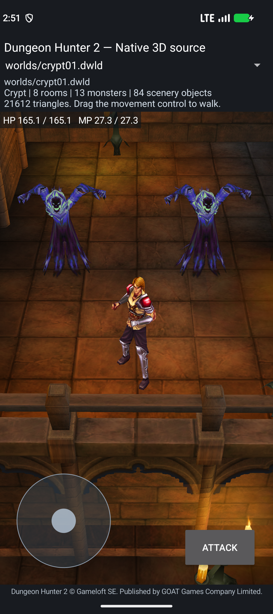
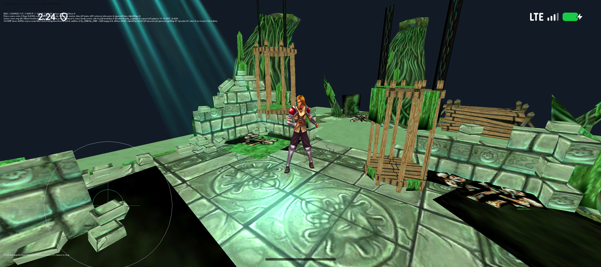

# Source AI and room-render checkpoint

This extends the [Crypt script/physics checkpoint](CRYPT-SCRIPT-CHECKPOINT-2026-10-04.md). Historical reports retain their APK identities. The [combined state, Adam comparison, improved project brief and roadmap](COMBINED-RECONSTRUCTION-STATUS.md) remain the continuation brief.

## Runnable builds

| Build | Local output | Bytes | SHA-256 |
| --- | --- | ---: | --- |
| Crypt with nine source AI units compiled | `port/android-native/app/build/crypt-ai-nine-source-candidate.apk` | 24,761,204 | `aecba18e8d2f2571f477f6420d9cc9053cb48f6482f573dabac49a47e2638054` |
| Irrlicht with source room scenery selection | `port/android-app/build/irrlicht-swamp-room-roles-candidate/dh2-swamp-irrlicht-source-local-debug.apk` | 72,063,674 | `c7094b5356cbc8f15af458112c2473a9925387024e35dd13c5d4f7d62d40431e` |

Both were installed and exercised on Android 17/API37/x86_64 with `PAGE_SIZE=16384`; installed bytes matched. Both package ARM64 and x86_64 source builds. Physical ARM64 gameplay remains untested. Neither is the complete game.

The [public release](https://github.com/Noamcelermajer/DH_sc/releases/tag/native-crypt-irrlicht-physics-2026-10-04) contains the previous `df725260…` Crypt and `2e3464ef…` Irrlicht APKs. The new outputs above are local candidates, not uploads to that release.

## New source reconstruction

Nine renderer-independent units build and export from `libdh2_level_world.so` for both Android ABIs, reusing Adam's existing float32 Lua core once per ABI. Live Ghost actor/controller wiring is still pending.

| Original anchor | New source | Implemented scope | Independent verification |
| --- | --- | --- | --- |
| `_UpdateAggro`, `0x3cf3f0` timing branch | [`character_aggro_delay.cpp`](../port/level-world/character_aggro_delay.cpp) | Turn/delay decisions, fresh delta reads, signed words and ordinary RNG | 20 original ARM comparisons + 10 guard cases; zero mismatches |
| `IsMyTurn`, `0x3cc484` | [`character_ai_turn.cpp`](../port/level-world/character_ai_turn.cpp) | Nonempty queue decision and fresh Follower/Faerie/virtual Player queries | 12 ARM comparisons + 14 guards; real original deque subtraction executes |
| TargetList constructor `0x4a2730`, Search `0x3d0020` / `0x4a2f34` | [`character_aggro_target_search.cpp`](../port/level-world/character_aggro_target_search.cpp) | Flags `0x7fffffff`, Character filter2, closest sort1; borrowed registry, geometry checks and heap | Two host suites / four ordered candidates; 11 original ranges and two virtual slots verified; no full Search instruction comparison |
| `_UpdateAggro` candidate loop | [`character_aggro_candidate_events.cpp`](../port/level-world/character_aggro_candidate_events.cpp) | Enemy→friend→neutral order, events before pop, all candidates, fresh event12 payload | 33 host cases + 16 original branch comparisons; zero mismatches |
| `OnEnemySpotted`, `0x3d14b4` | [`character_enemy_spotted.cpp`](../port/level-world/character_enemy_spotted.cpp) | Group/state gates, threat-add decision, late retained AIS dispatch | 38 host cases + 24 ARM comparisons; group/combat/aggro bodies remain external |
| AISExternal spotting `0x3dd2f4`, out-of-range `0x3dcde8` | [`monster_external_script_session.cpp`](../port/level-world/monster_external_script_session.cpp) | One source VM/VFTable session running two unchanged original callbacks with object-table identities | 24 host cases execute exact `_commons.luac` and `monster.luac`; OnInit/full AIS lifecycle excluded |
| `AI_SetTarget`, `0x3d6890` | [`character_ai_set_target.cpp`](../port/level-world/character_ai_set_target.cpp) | Requested/current/last target writes, force/null/tracing branches, sticky/alive/sight snapshots | Seven host suites + nine original ARM scenarios; virtual/sight/debug providers remain external |
| `AI_IsEnemy` / `AI_IsFriend` / `AI_IsNeutral`, `0x3d574c` / `0x3d511c` / `0x3d5a98` | [`character_ai_relations.cpp`](../port/level-world/character_ai_relations.cpp) | Three normal query orchestrations, handle/default/generic branches, fresh faction/global reads and captured-row first-match signs | 62 host cases + 78 ARM comparisons; invalid-ID diagnostic/assert paths excluded; existing enemy leaf reused |
| `AI_IsInCombat`, `0x3d4bc4` | [`character_ai_in_combat.cpp`](../port/level-world/character_ai_in_combat.cpp) | Exact caller short circuits, fresh owner state queries and raw Casting tail return | Nine ARM comparisons + eight guards; five underlying aggro/FSM query bodies remain borrowed services |

The [function map](generated/character-runtime-function-map.json) verifies original aliases, ranges and complete byte hashes: **139 distinct extension ranges / 173 records / 20 manifests / 84 addresses beyond Adam / 1,539 combined addresses**. Supporting ranges and duplicates are not additional fully rebuilt bodies.

### Findings that change the implementation

- The timed acquisition branch excludes players and **Faeries**; its later NPC gate is separate.
- IsMyTurn short circuits return1; its final virtual Player call returns the raw word.
- Aggro filter2/flags `0x7fffffff` differs from the existing melee filter0/flags1 query.
- Candidate payload is TargetInfo's GameObject identity, not separate Character metadata.
- No-enemy event `0xc` requires and carries the freshly read nonzero AI `+0x40` identity.
- OnEnemySpotted checks AwaitingToSpawn/state17 and Limbus/state0. Dead/state12 is not queried here.
- `AI_GetAggro` reads; `AI_AddAggro` mutates. The zero-threat branch must invoke the latter.
- Plain `monster` selects AISExternal. Both Lua `SetTarget` and `HeadTo` occur only when `HasTarget()` is false.
- The compatible source Lua core must be shared once; two raw Lua cores would duplicate symbols and mix integer configurations.
- The relation functions resolve `ObjectBase::GetHandle` / `ObjectHandle::GetObject(false)`, not an RTTI cast. The live resolved object's word `+0xf4` chooses Character versus generic behavior; generic enemy interaction queries use the original GameObject argument.
- Faction getters and counts must remain fresh. The owner is captured before the global table; row entries are read after the final target getter. Caching those facts can change source behavior during callbacks.
- Combat status ends with Casting, not Block. Target clearing under tracing still performs the lowercase diagnostic key lookup before returning.

## Android proof

The [Crypt artifact report](../reports/reconstruction-2026-10-04/source-ai-targeting/crypt-artifact.json) verifies 16 ELF64 libraries, load/ZIP 16KiB alignment, signing, all240 selected assets and40 source hashes. The [export report](../reports/reconstruction-2026-10-04/source-ai-targeting/crypt-abi-exports.json) requires all nine units, all three TargetList entry points and one Lua core per ABI.

The [fresh Crypt runtime](../reports/reconstruction-2026-10-04/source-ai-targeting/crypt-runtime.json) passes unchanged GhostAmbush01 contact/timed spawning using actual touch/root-motion movement from an explicit fan start override. Packaged start does not trigger the remote ambush. Both Ghosts hide in Limbus, appear through Spawn/native body creation and preserve Idle across reload and Activity recreation without replay. Unbound gated combat still rejects. Autonomous pursuit is not proved.

Host evidence: [delay](../reports/reconstruction-2026-10-04/source-ai/aggro-delay-host.json), [turn](../reports/reconstruction-2026-10-04/source-ai/turn-host.json), [search](../reports/reconstruction-2026-10-04/source-ai/target-search-host.json), [candidate events](../reports/reconstruction-2026-10-04/source-ai/candidate-events-host.json), [enemy spotted](../reports/reconstruction-2026-10-04/source-ai/enemy-spotted-host.json), [unchanged Lua](../reports/reconstruction-2026-10-04/source-ai/monster-session-host.json). ARM oracles compare host components; they are not game emulation or Android4KiB tests.

Targeting evidence: [target host](../reports/reconstruction-2026-10-04/source-ai-targeting/set-target-host.json), [target ARM](../reports/reconstruction-2026-10-04/source-ai-targeting/set-target-arm.json), [relations](../reports/reconstruction-2026-10-04/source-ai-targeting/relations-host-arm.json), [combat query](../reports/reconstruction-2026-10-04/source-ai-targeting/in-combat-host-arm.json), [independent combat review](../reports/reconstruction-2026-10-04/source-ai-targeting/in-combat-independent-review.json). A [19-path production snapshot](../reports/reconstruction-2026-10-04/source-ai-targeting/production-build-snapshot.json) measures CMake and all nine unit source/header hashes before and after the Gradle build and matches the artifact manifest. The earlier six-unit build `4998613b…` and its [separate proof](../reports/reconstruction-2026-10-04/source-ai/crypt-artifact.json) are retained.

## Irrlicht scenery correction

White bands were navigation meshes submitted as scenery. Original room assembly removes floor/root/exit instances from its visual list while preserving navigation. Serialized `visible=1` does not decide that scenery pass.

The opt-in [`build_source_room_scenery_mesh`](../port/irrlicht-android/game/scene_mesh_adapter.hpp) uses the exact bound root record and slash-bounded `_floor_` / `_exit_` components. Generic assembly remains available. Across nine modules,436 visible draws become392 scenery draws,9 bounds,16 floors and19 exits; all626 floor triangles remain. Module0 retains2 floors/99 triangles and10,816 vertices/13,284 indices, with49 scenery draws.

See [all-nine host](../reports/reconstruction-2026-10-04/source-room-render/all-nine-host.json), [floor bridge](../reports/reconstruction-2026-10-04/source-room-render/floor-bridge-host.json), [source audit](../port/irrlicht-android/reference/swamp-material-gap-audit/NOTES.md), [130-hash build report](../reports/reconstruction-2026-10-04/source-room-render/irrlicht-build.json) and [Android runtime](../reports/reconstruction-2026-10-04/source-room-render/irrlicht-runtime.json). Free motion, boundary sliding, Walk/Idle, Move unpin, Stop→Pin, matching actor/world counters and same-process HOME/resume pass. All three screenshots were visually inspected: white navigation polygons are absent and the Prince stays visible.

Dark patches, green billboard surfaces, exact custom shaders and original camera remain incomplete.

## Next work

1. Complete the remaining acquisition/retarget branches, queue/timer producers and live service ownership; the bounded target mutation, relation and combat-query kernels are now implemented and tested.
2. Bind acquisition/events/scripts to stable actor-owned AI, threat storage, source controllers/paths and complete external-script initialization.
3. Test authored spawning followed by acquisition, pursuit and attack, two independent Ghost sessions and restoration.
4. Continue factories, campaign systems, all levels, presentation, persistent saves, modding and physical ARM64 gameplay.

The complete native source-rebuild goal remains active. Full campaign playability has not been achieved.
