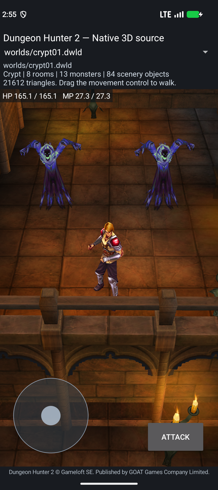

# Source level initialization checkpoint — 2026-10-04

Branch: `reconstruction/android17-irrlicht-rebuild-2026-10-03`.
Adam reference: `45c5348e807607a2825211bb8f26248067ba9106`.

## Build available to test

[Download the native Crypt development APK](https://github.com/Noamcelermajer/DH_sc/releases/download/native-crypt-level-initialization-2026-10-04/crypt-source-level-initialization-candidate.apk).

- SHA-256: `0bd8a06fa604f0778cc055b7141859c5df73ef325968e15e79da02ec4af0513a`.
- Size: 27,173,166 bytes; 246 packaged assets.
- NDK 29; ARM64 and x86_64; target/compile API 37; minimum API 24.
- All 16 native libraries are ELF64 with at least 16 KiB load alignment. ZIP alignment and signing verification pass.
- Forty bounded AI/script/zone units and 60 required export groups pass in both ABIs.
- The 418 actual repository compiler/build inputs were unchanged before and after the build. The release's compiled-source archive preserves their exact raw bytes; Git may normalize line endings.
- The original ARM32 game library is not an app runtime dependency.

This development APK runs the authored Crypt, Prince movement, original ambush scripts and two native Ghost bodies. Active Ghost AI initialization, pursuit and attacks are still pending. Physical ARM64 gameplay has not been tested.

## Actual Android test

The exact installed APK passed on Android 17/API 37 x86_64 with `PAGE_SIZE=16384`:

1. Touch/root-motion movement entered the unchanged original GhostAmbush01 trigger using an explicitly labeled temporary fan start override.
2. The original timed script made both Spawn requests. Each Ghost received its native body once, entered Idle, hid in Limbus and restored source visibility.
3. Reload and rotation retained the consumed trigger and visible Ghosts without replaying it.
4. The native owned level catalogue contained all 33 FastTravel and 51 Level records.
5. The reconstructed Level constructor field slice selected Crypt ordinal 23, hub 2, random flag 1 and filename `007_crypt_01.rule.xml`. All three original range callbacks returned `8–10 / 45–47 / 74–76` after load, reload and recreation.

The viewport owns these Level fields and explicitly supplies development normal difficulty 0. Original GSLevel/application-stack ownership and campaign difficulty selection remain pending. Missing combat services reject explicitly. These observations do not prove pursuit, Ghost attacks, a complete level or campaign saves.

Root inspected the screenshot: the Prince and both textured Ghosts are visible.

See [artifact validation](../reports/reconstruction-2026-10-04/source-level-initialization/artifact.json), [runtime test](../reports/reconstruction-2026-10-04/source-level-initialization/runtime/crypt-script-smoke.json), [ABI exports](../reports/reconstruction-2026-10-04/source-level-initialization/abi-exports.json), [production inputs](../reports/reconstruction-2026-10-04/source-level-initialization/production-build-snapshot.json) and [component hashes](../reports/reconstruction-2026-10-04/source-level-initialization/frozen-inputs.json).

## Rebuilt source and evidence

These checks retain explicit imported-function and ownership boundaries. Host composition is reported separately from Android integration.

| Source component | Independently checked | Integration boundary |
|---|---|---|
| Owned LevelTables decoder | 84 decoded records, 153 range reads, 12 rejection/retention guards, 84 original ARM reader records | All three original cache tables packaged and consumed natively. Schema, strings, boolean width and field order preserved. |
| Level constructor fields | 12 host cases; 14 original ARM constructor spans | Bounded ordinal/hub/random/difficulty slice; native viewport owner. Entire 920-byte constructor and GSLevel stack are not claimed. |
| Lua host/range queries | 17 host cases and original caller comparisons with zero mismatches | Current-range callback uses owned native fields/table. Host PlayerInfo ownership remains external. |
| Character SetLevel | Original caller comparison and source request ordering | Level writes, class recalculation and HP/MP regeneration are compiled; live native monster OnInit wiring remains pending. |
| HP/MP regeneration | Original caller comparisons with zero mismatches | Preserves fresh design/property/debug reads and partial effects on failure. |
| Debug switch runtime | 41 host / 48 original ARM cases | Owned maps, actual load/query behavior, source reentry and defaults. |
| Debug persistence | 44 host / 48 ARM cases | Real typed writes and close; live map traversal and source mutation ordering. |
| Unchanged monster OnInit composition | 24 host cases, including 18 positive original catalogue cases | Two Ghosts × Crypt/Swamp/Infected × three difficulties, actual class/HP/MP/debug/real-file persistence. PlayerInfo/Level services remain host fixtures. |
| Pending Ghost session | 13 host groups | Original stage 6 publishes the same pending VM. Queries can run before activation; acquisition cannot. |
| Native Ghost owner | Eight owner cases plus existing target cases | Adopts the exact staged VM and retained services; no second VM. Owner is not yet bound to live Android enemy controllers. |
| PlayerInfo level member | Eight host / eight ARM cases | Plain integer at original +0x330; member serial/change behavior. Host-only and unlinked. |
| Module RoomZone bounds | 105 ARM cases | Exact source bound/dimension/center writes and named SetPosition callback; live native RoomZone ownership pending. |
| Module scene-root bounds | Nine actual SWAMP modules; 421 geometry instances / 436 primitives | Source root-reset placement, header bounds versus vertices, owner translation applied once. Host-only and unlinked. |

The [component reports](../reports/reconstruction-2026-10-04/source-level-initialization/components) carry source hashes and detailed scope. The original ARM binary is used only for offline instruction comparisons. Additional drafts under development are excluded from this APK and its frozen source archive.

## Findings that change the implementation

- The Level constructor lowercases each catalogue filename before comparing against the incoming name. It stores the first matching row; the incoming name itself remains case-sensitive.
- PlayerInfo's host level is a plain integer, distinct from Character's fixed-point Level property. `PROPS_GetInt(19,false)` already shifts the property by eight; shifting it again changes the value.
- Original monster OnInit genuinely invokes SetLevel, class recalculation, regeneration and debug queries. Positive level ranges cannot be handled by skipping initialization.
- Character SetLevel and regeneration retain earlier mutations when a later provider fails. Copy/commit rollback would alter the game.
- Pending and active AIS have separate identities. Stage 6 publishes the same VM after common/external code and OnInit; native owner adoption must follow this publication.
- Module loading resets the selected scene child transform, then positions the outer root from its owner. Applying the cached transform again would duplicate placement.
- Navigation PFRoom, authored DACT room indices, RoomZone and the generic aggro object-list adapter require separate source ownership evidence. Their indices are not interchangeable.

## Next implementation goals

1. Retain native class/design/debug storage and real managed PlayerInfo state. Bind the reconstructed host-level/difficulty/range and SetLevel services to the pending monster VM; complete real OnInit and activation.
2. Reconstruct the actual aggro object-list producer and stable native object ownership. Bind queue/frame/target/path services and prove both Ghosts acquire and pursue the Prince through their real bodies.
3. Test attacks, health, death, loot and original respawn behavior; resolve remaining Crypt factories and complete one original level.
4. Extend level transitions, quests, progression, UI, materials, audio/effects, campaign saves and fan modding contracts across the original content.
5. Verify clean native builds and sustained gameplay on a physical current-Android ARM64 device.

The full-game goal remains active. Mapping reach, source size, exports and isolated comparisons do not measure playable completion.
